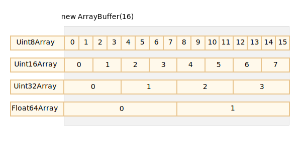
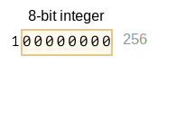
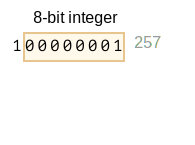
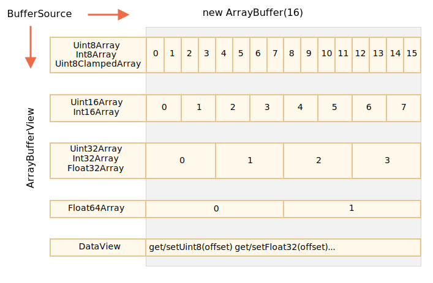

# ArrayBuffer, tableaux binaires

Dans le développement web, nous rencontrons des données binaires principalement lorsque l'on travaille avec des fichiers (création, envoi, téléchargement). Un autre cas d'utilisation est le traitement d'image.

Tout ceci est possible en JavaScript, et les opérations binaires sont très performantes.

Cependant, il y a de la confusion, car il y a beaucoup de classes disponibles.
Pour en nommer quelques unes:
- `ArrayBuffer`, `Uint8Array`, `DataView`, `Blob`, `File`, etc.

En javascript, les données binaires sont implémentées de façon non standard, comparé à d'autres langages. Mais quand nous mettons de l'ordre dans tout ça, tout devient beaucoup plus simple.

**L'objet binaire de base est un `ArrayBuffer` -- une référence à une zone contigüe de taille fixe de la mémoire.**

Nous le créons comme ceci:
```js run
let buffer = new ArrayBuffer(16); // crée un Buffer de taille 16
alert(buffer.byteLength); // 16
```

Cela alloue une zone contigue de 16 octets dans la mémoire et la pré-remplie avec des zéros.

```warn header="L'`ArrayBuffer` n'est pas un tableau de 'quelque chose'."
Commençons par éliminer une possible source de confusion. `ArrayBuffer` n'a rien en commun avec `Array`:
- Il possède une taille fixe, nous ne pouvons ni l'aggrandir, ni le réduire.
- Il prend une taille spécifique en mémoire.
- Pour accéder à des octets individuels, un autre objet de "vue" est nécessaire, on n'utilise pas `buffer[index]`.
```

`ArrayBuffer` est une zone de la mémoire. Qui y'a t'il à l'intérieur ? Juste une séquence d'octets.

**Pour manipuler un `ArrayBuffer`, nous avons besoin d'utiliser un objet de "vue".**

Un objet de "vue" ne stocke rien tout seul. Ce sont les lunettes qui donnent une interprétation des octets stockés dans l'`ArrayBuffer`.

Par exemple:

- **`Uint8Array`** -- Traite chaque octet dans l'`ArrayBuffer` comme un nombre unique, avec des valeurs possibles entre 0 jusqu'à 255 (Un octet est sur 8 bits, donc ça ne peut contenir que ça). On appelle ces valeurs des "entiers non signés sur 8 bits".
- **`Uint16Array`** -- Traite par paquet de 2 octets en tant qu'entier, avec des valeurs possibles entre 0 jusqu'à 65535. On appelle ces valeurs des "entiers non signés sur 16 bits".
- **`Uint32Array`** -- Traite par paquet de 4 octets en tant qu'entier, avec des valeurs possibles entre 0 jusqu'à 4294967295. On appelle ces valeurs des "entiers non signés sur 32bits".
- **`Float64Array`** -- Traite par paquet de 8 octets en tant que nombre flottant avec des valeurs possibles entre <code>5.0x10<sup>-324</sup></code> et <code>1.8x10<sup>308</sup></code>.

Donc, les données binaires dans un `ArrayBuffer` de 16 octets peuvent être interprétées comme 16 "petits nombres" , ou 8 grands nombres (2 octets chacun), ou 4 encore plus grands (4 octets chacun), ou 2 valeurs flottantes avec une haute précision (8 octets chacun).



`ArrayBuffer` est l'objet central, le centre de tout, les données binaires brutes.

Mais si nous voulons écrire à l'intérieur, ou itérer dessus, pour n'importe quelle opération – nous devons utiliser une "vue", e.g:

```js run
let buffer = new ArrayBuffer(16); // crée un buffer de taille 16

*!*
let view = new Uint32Array(buffer); // Traite le buffer en une séquence d'entiers de 32 bits.

alert(Uint32Array.BYTES_PER_ELEMENT); // 4 octets par entier.
*/!*

alert(view.length); // 4, il stocke cette quantité d'entiers.
alert(view.byteLength); // 16, la taille en octets.

// Ecrivons une valeur
view[0] = 123456;

// Itérons sur les valeurs
for(let num of view) {
  alert(num); // 123456, puis 0, 0, 0 (4 valeurs au total)
}

```

## TypedArray - tableau typé

Le terme commun pour toutes ces vues (`Uint8Array`, `Uint32Array`, etc) est [TypedArray](https://tc39.github.io/ecma262/#sec-typedarray-objects). Elles partagent le même ensemble de méthodes et de propriétés.

Il faut noter qu'il n'y a pas de construteur appelé `TypedArray`, Il s'agit d'un terme pour représenter une des vues par dessus un `ArrayBuffer`: `Int8Array`, `Uint8Array` etc. La liste entière va bientôt suivre.

Lorsque vous voyez quelque chose comme `new TypedArray`, Il s'agit de n'importe quoi parmi `new Int8Array`, `new Uint8Array`, etc.

Les tableaux typés ressemblent à des tableaux classiques : ils ont des indexs et sont itérables.

Un constructeur `TypedArray` (soit `Int8Array` ou `Float64Array`, peut importe) se comporte différement en fonction du type des arguments.

Il y a 5 variantes d'arguments:

```js
new TypedArray(buffer, [byteOffset], [length]);
new TypedArray(object);
new TypedArray(typedArray);
new TypedArray(length);
new TypedArray();
```

1. Si un `ArrayBuffer` est fourni, la vue est créée dessus. Nous avons déjà utilisé cette syntaxe.

    Nous pouvons éventuellement fournir un décalage (`byteOffset`) pour commencer à partir de là (0 par défaut) et la longueur (`length`) (jusqu'à la fin du buffer par défaut), alors la vue ne va couvrir qu'une partie du `buffer`.

2. Si c'est un `Array`, ou quelque chose ressemblant à un tableau qui est fourni, il crée un tableau typé de la même longueur et copie le contenu.

    Nous pouvons l'utiliser pour pré-remplir le tableau avec les données:
    ```js run
    *!*
    let arr = new Uint8Array([0, 1, 2, 3]);
    */!*
    alert( arr.length ); // 4, a créé une liste binaire de la même taille
    alert( arr[1] ); // 1, remplit avec 4 octets (entiers non signés sur 8 bits) avec des valeurs données
    ```
3. Si un autre tableau typé est fourni, il fait la même chose: il crée un tableau typé de la même taille et copie le contenu. Les valeurs sont converties vers le nouveau type dans le processus si besoin.
    ```js run
    let arr16 = new Uint16Array([1, 1000]);
    *!*
    let arr8 = new Uint8Array(arr16);
    */!*
    alert( arr8[0] ); // 1
    alert( arr8[1] ); // 232, 1000 ne rentre pas dans 8 bits (explications plus loin)
    ```

4. Si un argument `length` est fourni -- Il crée un tableau typé qui contient autant d'éléments. Sa taille en octets va être `length` multiplié par la taille en octets d'un seul élément `TypedArray.BYTES_PER_ELEMENT`:
    ```js run
    let arr = new Uint16Array(4); // Création d'un tableau typé de 4 entiers
    alert( Uint16Array.BYTES_PER_ELEMENT ); // 2 octets par entier
    alert( arr.byteLength ); // 8 (taille en octets)
    ```

5. Sans arguments, il crée un tableau typé de taille nulle.

Nous pouvons créer un tableau typé directement sans fournir un `ArrayBuffer`. Mais une vue ne peut pas exister sans, donc il sera créé automatiquement dans tous les cas, sauf le premier (quand il est passé en argument).

<<<<<<< HEAD
Pour accéder à l'`ArrayBuffer`, il y a plusieurs propriétés:
- `arr.buffer` -- qui fait référence à l'`ArrayBuffer`.
- `arr.byteLength` -- qui correspond à la taille de l'`ArrayBuffer`.
=======
To access the underlying `ArrayBuffer`, there are following properties in `TypedArray`:
- `buffer` -- references the `ArrayBuffer`.
- `byteLength` -- the length of the `ArrayBuffer`.
>>>>>>> 4541b7af7584014a676da731f6e8774da5e059f6

Donc nous pouvons toujours passer d'une vue à l'autre:
```js
let arr8 = new Uint8Array([0, 1, 2, 3]);

// Une autre vue avec les mêmes données
let arr16 = new Uint16Array(arr8.buffer);
```


Voici une liste de tableaux typés:

- `Uint8Array`, `Uint16Array`, `Uint32Array` -- Pour les entiers de 8, 16 et 32 bits.
  - `Uint8ClampedArray` -- Pour les entiers de 8 bits, avec une "restriction" à l'affectation (voir plus loin).
- `Int8Array`, `Int16Array`, `Int32Array` -- Pour les nombres entiers signés (peuvent être négatifs).
- `Float32Array`, `Float64Array` -- Pour les nombres flottants signés de 32 et 64 bits.

```warn header="Pas de `int8` ou de types similaires"
Malgré la présence de noms tels que `Int8Array`, il n'y a pas de type comme `int` ou `int8` dans JavaScript. 

Car en effet `Int8Array` n'est pas un tableau de ces valeurs individuelles, mais plutôt une vue sur `ArrayBuffer`.
```

### Comportement hors limite

Que se passe t'il lorsque nous essayons d'écrire des valeurs en dehors des limites dans un tableau typé ? Il n'y aura pas d'erreurs, mais les bits en trop seront supprimés.

Par exemple, essayons d'ajouter 256 dans un `Uint8Array`. En binaire, 256 s'écrit `100000000` (9 bits), mais un `Uint8Array` ne permet que 8 bits par valeur, ce qui donne des valeurs possibles entre 0 et 255.

Pour les grands nombres, seuls les 8 bits les plus à droite (moins significatif) sont sauvegardés, et le reste est supprimé:



Donc nous allons obtenir 0.

Pour 257, l'écriture binaire est `100000001` (9 bits), les 8 bits les plus à droite sont gardés, donc on aura un `1` dans notre tableau:



En d'autres termes, Le nombre modulo 2<sup>8</sup> est sauvegardé.

Démonstration:

```js run
let uint8array = new Uint8Array(16);

let num = 256;
alert(num.toString(2)); // 100000000 (représentation binaire)

uint8array[0] = 256;
uint8array[1] = 257;

alert(uint8array[0]); // 0
alert(uint8array[1]); // 1
```

`Uint8ClampedArray` possède un comportement différent. Il garde 255 pour n'importe quel nombre qui est plus grand que 255, et 0 pour n'importe quel nombre négatif. Ce comportement est utile dans le traitement d'images.

## Méthodes des tableaux typés

`TypedArray` possède les méthodes de `Array`, avec quelques exceptions notables.

Nous pouvons itérer, `map`, `slice`, `find`, `reduce` etc.

Mais certaines choses ne sont pas possibles:

- Pas de `splice` -- On ne peut pas supprimer une valeur, car les tableaux typés sont des vues sur un `buffer`, qui sont des zones fixes dans la mémoire. Tout ce que nous pouvons faire est de mettre un 0.
- Pas de méthode `concat`.

Il y a deux méthodes supplémentaires:

- `arr.set(fromArr, [offset])` copie tous les éléments de `fromArr` vers `arr`, en commençant à partir de la position `offset` (0 par défaut).
- `arr.subarray([begin, end])` crée une nouvelle vue du même type de `begin` jusqu'à `end` (non-inclus). C'est similaire à la méthode `slice` (qui est également disponible), mais elle ne copie rien -- il s'agit juste d'une création d'une nouvelle vue, pour travailler sur un certain morceau de données.

Les méthodes nous permettent de copier des tableaux typés, de les mélanger, de créer des nouveaux tableaux depuis ceux existants, et bien d'autres choses.

## DataView

[DataView](mdn:/JavaScript/Reference/Global_Objects/DataView) est une vue spéciale "non typée" super flexible sur ʻArrayBuffer`. Il permet d'accéder aux données sur n'importe quel offset dans tous les formats.

- Pour les tableaux typés, le constructeur détermine le format. Le tableau entier est supposé être uniforme. Le i-ème nombre est noté `arr[i]`.
- Avec `DataView` nous accédons aux données avec des méthodes comme `.getUint8(i)` ou `.getUint16(i)`. Nous choisissons le format au moment de l'utilisation de la méthode au lieu du moment de la création.

Voici la syntaxe:

```js
new DataView(buffer, [byteOffset], [byteLength])
```

- **`buffer`** -- `ArrayBuffer`. Contrairement aux tableaux typés, `DataView` ne crée pas soit même un buffer. Nous avons besoin de le lui fournir directement.
- **`byteOffset`** -- L'octet de départ de la vue (par défaut à 0).
- **`byteLength`** -- La taille totale de la vue en octets (par défaut jusqu'à la fin de `buffer`).

Pour l'exemple, nous allons récupérer des nombres dans plusieurs formats avec le même buffer:

```js run
// Tableau binaire de 4 octets, tous ayant la valeur maximale - 255
let buffer = new Uint8Array([255, 255, 255, 255]).buffer;

let dataView = new DataView(buffer);

// récupération d'un nombre en 8 bits avec un décalage de 0
alert( dataView.getUint8(0) ); // 255

// récupération d'un nombre en 16 bits avec un décalage de 0, soit 2 octets, qui sont interprétés ensemble en 65535
alert( dataView.getUint16(0) ); // 65535 (Plus grand entier non signé en 16 bits)

// récupération d'un nombre en 32 bits avec un décalage de 0
alert( dataView.getUint32(0) ); // 4294967295 (Plus grand entier non signé en 32 bits)

dataView.setUint32(0, 0); // Fixe le nombre sous 4 octets à 0, fixant ainsi tous les octets à 0
```

`DataView` est utile lorsque l'on met des données sous plusieurs formats dans le même buffer. Par exemple, on stocke une séquence de paires (16-bit integer, 32-bit float). `DataView` nous permettra d'y accéder facilement.

## Résumé

`ArrayBuffer` est l'objet au coeur de tout, c'est une référence à une zone de taille fixe dans la mémoire.

Pour faire presque n'importe quelle opération sur un `ArrayBuffer`, nous avons besoin d'une vue.

- Il peut s'agir d'un tableau typé:
    - `Uint8Array`, `Uint16Array`, `Uint32Array` -- pour les entiers non-signés de 8, 16, et 32 bits.
    - `Uint8ClampedArray` -- pour les entiers de 8 bits, "clamps" them on assignment.
    - `Int8Array`, `Int16Array`, `Int32Array` -- pour les entiers signés (peuvent être négatifs).
    - `Float32Array`, `Float64Array` -- pour les nombres flottants signés de 32 et 64 bits.
- Ou d'un `DataView` -- la vue qui utilise des méthodes pour spécifier un format, e.g. `getUint8(offset)`.

Dans la majorité des cas, on crée et on opère directement sur les tableaux typés, laissant `ArrayBuffer` en arrière. On peut toujours y accéder avec `.buffer` et faire une nouvelle vue si besoin.

Il y a également 2 termes supplémentaires, qui sont utilisés dans les descriptions des méthodes pour travailler sur les données binaires:
- `ArrayBufferView` qui est le terme pour tous les types de vues.
- `BufferSource` qui est un terme désignant soit un `ArrayBuffer` ou un `ArrayBufferView`.

Nous verrons ces termes dans les prochains chapitres. `BufferSource` est l'un des termes les plus communs, qui veut dire "toutes sortes de données binaires" -- un `ArrayBuffer` ou une vue par dessus.

Voici un cheatsheet :


