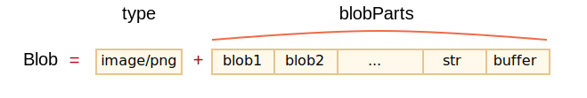

# Blob

`ArrayBuffer` et les vues font partie de la norme ECMA, une partie de JavaScript.

Dans le navigateur, il existe d'autres objets de niveau supérieur, décrits dans [File API](https://www.w3.org/TR/FileAPI/), en particulier `Blob`.

`Blob` consiste en une chaîne de caractères optionnelle `type` (un type de MIME habituellement), plus `blobParts` -- une séquence d'autres objets `Blob` , chaînes de caractères et `BufferSource`.



La syntaxe du constructeur est la suivante:

```js
new Blob(blobParts, options);
```

- **`blobParts`** est un tableau de `Blob`/`BufferSource`/`String`.
- **`options`** objet optionnel:
  - **`type`** -- le type du `Blob`, généralement de type MIME, par exemple. `image/png`,
  - **`endings`** -- s'il faut transformer la fin de ligne pour rendre le `Blob` correspondent aux nouvelles lignes de l'OS actuel (`\r\n` ou `\n`). `"transparent"` Par défaut (ne fait rien), mais peut aussi être `"native"` (transformer).

Par exemple:

```js
// créer un Blob à partir d'une chaîne
let blob = new Blob(["<html>…</html>"], {type: 'text/html'});
// veuillez noter: le premier argument doit être un tableau [...]
```

```js
// créer un objet blob à partir d'un tableau typés et de chaînes de caractères
let hello = new Uint8Array([72, 101, 108, 108, 111]); // "Hello" sous forme binaire

let blob = new Blob([hello, ' ', 'world'], {type: 'text/plain'});
```

Nous pouvons extraire des parties du `Blob` avec:

```js
blob.slice([byteStart], [byteEnd], [contentType]);
```

- **`byteStart`** -- l'octet de départ, par défaut 0.
- **`byteEnd`** -- le dernier octet (exclusif, par défaut jusqu'à la fin).
- **`contentType`** -- Le `type` du nouvel objet blob, par défaut le même que la source.

Les arguments sont similaires à `array.slice`, les nombres négatifs sont également autorisés.

```smart header="Les objets `Blob` sont immuables"
Nous ne pouvons pas modifier les données directement dans un `Blob`, mais nous pouvons découper des parties d'un `Blob`, créer de nouveaux objets `Blob` à partir d'eux, les mélanger dans un nouveau` Blob` et ainsi de suite.

Ce comportement est similaire aux chaînes de caractères JavaScript: nous ne pouvons pas changer un caractère dans une chaîne, mais nous pouvons créer une nouvelle chaîne corrigée.
```

## Blob comme URL

Un Blob peut être facilement utilisé comme URL pour `<a>`, `` ou d'autres balises, pour afficher son contenu.

Grâce au `type`, nous pouvons également télécharger / uploader des objets `Blob`, et le `type` devient naturellement `Content-Type` dans les requêtes réseau.

Commençons par un exemple simple. En cliquant sur un lien, vous téléchargez un `Blob` généré dynamiquement avec le contenu de `hello world` sous forme de fichier:

```html run
<!-- l'attribut de téléchargement force le navigateur à télécharger au lieu de naviguer -->
<a download="hello.txt" href='#' id="link">Download</a>

<script>
let blob = new Blob(["Hello, world!"], {type: 'text/plain'});

link.href = URL.createObjectURL(blob);
</script>
```

On peut aussi créer un lien dynamiquement en JavaScript et simuler un clic par `link.click()`, puis le téléchargement démarre automatiquement.

Voici un code similaire qui oblige l'utilisateur à télécharger le `Blob` créé dynamiquement, sans aucun HTML :

```js run
let link = document.createElement('a');
link.download = 'hello.txt';

let blob = new Blob(['Hello, world!'], {type: 'text/plain'});

link.href = URL.createObjectURL(blob);

link.click();

URL.revokeObjectURL(link.href);
```

`URL.createObjectURL` prend un `Blob` et crée une URL unique pour celui-ci, sous la forme `blob:<origin>/<uuid>`.

Voilà à quoi ressemble la valeur de `link.href`:

```
blob:https://javascript.info/1e67e00e-860d-40a5-89ae-6ab0cbee6273
```

Pour chaque URL générée par `URL.createObjectURL`, le navigateur stocke en interne un mappage URL -> `Blob`. De telles URL sont donc courtes, mais permettent d'accéder au `Blob`.

Une URL générée (et donc le lien avec elle) n'est valide que dans le document actuel, tant qu'il est ouvert. Et cela permet de référencer le `Blob` dans ``, `<a>`, essentiellement tout autre objet qui attend une URL.

Une URL générée (et donc le lien avec elle) n'est valide que dans le document actuel, tant qu'il est ouvert. Et cela permet de référencer le `Blob` dans ``,`<a>`, ou tout autre objet qui attend une URL.

Il y a cependant un effet secondaire. Bien qu'il y ait un mappage pour un `Blob`, le `Blob` lui-même réside dans la mémoire. Le navigateur ne peut pas le libérer.

Le mappage est automatiquement effacé lors du déchargement du document, les objets `Blob` sont alors libérés. Mais si une application dure longtemps, cela ne se produit pas de sitôt.

**Donc, si nous créons une URL, ce `Blob` restera en mémoire, même s'il n'est plus nécessaire.**

`URL.revokeObjectURL(url)` supprime la référence du mappage interne, permettant ainsi de supprimer le `Blob` (s'il n'y a pas d'autres références), et de libérer la mémoire.

Dans le dernier exemple, nous voulons que le `Blob` ne soit utilisé qu'une seule fois, pour un téléchargement instantané, donc nous appelons `URL.revokeObjectURL(link.href)` immédiatement.

Dans l'exemple précédent avec le lien HTML cliquable, nous n'appelons pas `URL.revokeObjectURL(link.href)`, car cela rendrait l'url `Blob` invalide. Après la révocation, comme le mappage est supprimé, l'URL ne fonctionne plus.

## Blob en base64

Une alternative à `URL.createObjectURL` est de convertir un `Blob` en une chaîne de caractères encodée en base64.

Cet encodage représente des données binaires sous la forme d'une chaîne de caractères "lisibles" ultra-sûrs avec des codes ASCII de 0 à 64. Et ce qui est plus important - nous pouvons utiliser cet encodage dans "data-urls".

Une [URL de données](mdn:/http/Data_URIs) a la forme `data:[<mediatype>][;base64],<data>`. Nous pouvons utiliser de telles URL partout, au même titre que les URL "ordinaires".

Par exemple, voici un smiley:

```html

```

Le navigateur décodera la chaîne de caractères et affichera l'image: 

Pour transformer un `Blob` en base64, nous utiliserons l'objet `FileReader` intégré. Il peut lire les données des Blobs dans plusieurs formats. Dans le [chapitre suivant](info:file) nous le couvrirons plus en détail.

Voici la démo du téléchargement d'un blob, maintenant via base-64:

```js run
let link = document.createElement('a');
link.download = 'hello.txt';

let blob = new Blob(['Hello, world!'], {type: 'text/plain'});

*!*
let reader = new FileReader();
reader.readAsDataURL(blob); // convertit le blob en base64 et appelle onload
*/!*

reader.onload = function() {
  link.href = reader.result; // URL de données
  link.click();
};
```

Les deux manières de créer une URL d'un `Blob` sont utilisables. Mais généralement `URL.createObjectURL(blob)` est plus simple et plus rapide.

```compare title-plus="URL.createObjectURL(blob)" title-minus="Blob vers l'URL de données"
+ Nous devons les révoquer si nous nous soucions de la mémoire.
+ Accès direct au blob, pas d'"encodage / décodage"
- Pas besoin de révoquer quoi que ce soit.
- Perte de performances et de mémoire sur les gros objets `Blob` pour l'encodage.
```

## Image à blob

Nous pouvons créer un `Blob` d'une image, une partie d'image, ou même faire une capture d'écran de page. C'est pratique pour le télécharger quelque part.

Les opérations sur les images se font via l'élément `<canvas>`:

1. Dessinez une image (ou sa partie) sur le canevas en utilisant [canvas.drawImage](mdn:/api/CanvasRenderingContext2D/drawImage).
2. Appeler la méthode canvas [.toBlob(callback, format, quality)](mdn:/api/HTMLCanvasElement/toBlob) qui crée un `Blob` et exécute `callback` avec lui une fois terminé.

Dans l'exemple ci-dessous, une image est simplement copiée, mais nous pourrions la couper ou la transformer sur un canevas avant de créer un blob:

```js run
// prendre n'importe quelle image
let img = document.querySelector('img');

// rendre <canvas> de la même taille
let canvas = document.createElement('canvas');
canvas.width = img.clientWidth;
canvas.height = img.clientHeight;

let context = canvas.getContext('2d');

// copier l'image dessus (cette méthode permet de couper l'image)
context.drawImage(img, 0, 0);
// nous pouvons context.rotate(), et faire beaucoup d'autres choses sur canvas

// toBlob est une opération asynchrone, le callback est appelé lorsque c’est terminé
canvas.toBlob(function(blob) {
  // blob prêt, téléchargez-le
  let link = document.createElement('a');
  link.download = 'example.png';

  link.href = URL.createObjectURL(blob);
  link.click();

  // supprimer la référence blob interne, pour laisser le navigateur en effacer la mémoire
  URL.revokeObjectURL(link.href);
}, 'image/png');
```

Si nous préférons `async/await` au lieu de callbacks:
```js
let blob = await new Promise(resolve => canvasElem.toBlob(resolve, 'image/png'));
```

Pour faire une capture d'écran d'une page, nous pouvons utiliser une bibliothèque telle que <https://github.com/niklasvh/html2canvas>. Ce qu'elle fait, c'est simplement parcourir la page et la dessiner sur un `<canvas>`. Ensuite, nous pouvons en obtenir un `Blob` de la même manière que ci-dessus.

## De Blob à ArrayBuffer

Le constructeur `Blob` permet de créer un blob à partir de presque tout, y compris de n'importe quel `BufferSource`.

Mais si nous devons effectuer un traitement de bas niveau, nous pouvons obtenir le `ArrayBuffer` de plus bas niveau à partir de `blob.arrayBuffer()` :

```js
// obtenir arrayBuffer à partir de blob
const bufferPromise = await blob.arrayBuffer();

// or
blob.arrayBuffer().then(buffer => /* process the ArrayBuffer */);
```

## From Blob to stream

When we read and write to a blob of more than `2 GB`, the use of `arrayBuffer` becomes more memory intensive for us. At this point, we can directly convert the blob to a stream.

A stream is a special object that allows to read from it (or write into it) portion by portion. It's outside of our scope here, but here's an example, and you can read more at <https://developer.mozilla.org/en-US/docs/Web/API/Streams_API>. Streams are convenient for data that is suitable for processing piece-by-piece.

The `Blob` interface's `stream()` method returns a `ReadableStream` which upon reading returns the data contained within the `Blob`.

Then we can read from it, like this:

```js
// get readableStream from blob
const readableStream = blob.stream();
const stream = readableStream.getReader();

while (true) {
  // for each iteration: value is the next blob fragment
  let { done, value } = await stream.read();
  if (done) {
    // no more data in the stream
    console.log('all blob processed.');
    break;
  }

   // do something with the data portion we've just read from the blob
  console.log(value);
}
```

## Résumé

Alors qu'`ArrayBuffer`, `Uint8Array` et autres `BufferSource` sont des "données binaires", un [Blob] (https://www.w3.org/TR/FileAPI/#dfn-Blob) représente des "données binaires de type".

Cela rend les Blobs pratiques pour les opérations de téléchargement (upload / download), qui sont courantes dans le navigateur.

Les méthodes qui effectuent des requêtes Web, telles que [XMLHttpRequest](info:xmlhttprequest), [fetch](info:fetch) et ainsi de suite, peuvent fonctionner avec `Blob` de manière native, ainsi qu'avec d'autres types binaires.

Nous pouvons facilement convertir les types de données binaires `Blob` et de bas niveau :

- Nous pouvons créer un `Blob` à partir d'un tableau typé en utilisant le constructeur `new Blob(...)`.
- Nous pouvons récupérer `ArrayBuffer` à partir d'un Blob en utilisant `blob.arrayBuffer()`, puis créer une vue dessus pour le traitement binaire de bas niveau.

Les flux de conversion sont très utiles lorsque nous devons gérer de gros blob. Vous pouvez facilement créer un `ReadableStream` à partir d'un blob. La méthode `stream()` de l'interface `Blob` renvoie un `ReadableStream` qui, lors de la lecture, renvoie les données contenues dans le blob.
