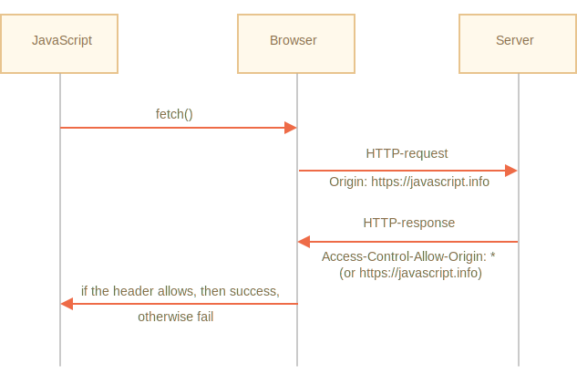
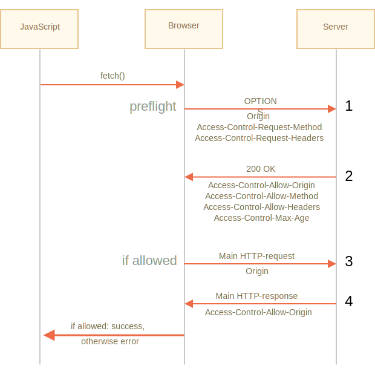

# Fetch: Requêtes Cross-Origin 

Si nous envoyons une requête `fetch` à un autre site Web, elle échouera probablement.

Par exemple, essayons de récupérer `http://example.com` :

```js run async
try {
  await fetch('http://example.com');
} catch(err) {
  alert(err); // Échec de la récupération
}
```

La récupération échoue, comme prévu.

Le concept principal ici est *origin* - un triplet domaine/port/protocole.

Les requêtes cross-origin - celles envoyées vers un autre domaine (même un sous-domaine) ou un protocole ou un port - nécessitent des en-têtes spéciaux du côté distant.

Cette politique est appelée "CORS": Cross-Origin Resource Sharing.

## Pourquoi CORS est-il nécessaire ? Un bref historique

CORS existe pour protéger Internet des diaboliques pirates.

Plus sérieusement, faisons une très brève digression historique.

**Pendant de nombreuses années, un script d'un site n'a pas pu accéder au contenu d'un autre site.**

Cette règle simple mais puissante a été le fondement de la sécurité Internet. Par exemple. un script malveillant du site Web `hacker.com` ne pouvait pas accéder à la boîte aux lettres de l'utilisateur sur le site Web `gmail.com`. Les gens se sentaient en sécurité.

JavaScript n'avait pas non plus de méthodes spéciales pour effectuer des requêtes réseau à l'époque. C'était un langage pour s'amuser à décorer une page Web.

Mais les développeurs Web ont demandé plus de puissance. Diverses astuces ont été inventées pour contourner la limitation et faire des demandes à d'autres sites Web.

### Utilisation de formulaires

Une façon de communiquer avec un autre serveur était de soumettre un `<form>`. Les gens l'ont soumis dans un `<iframe>`, juste pour rester sur la page actuelle, comme ceci :

```html
<!-- depuis la cible -->
*!*
<iframe name="iframe"></iframe>
*/!*

<!-- un formulaire pourrait être généré dynamiquement et soumis par JavaScript -->
*!*
<form target="iframe" method="POST" action="http://another.com/…">
*/!*
  ...
</form>
```

Ainsi, il était possible de faire une demande GET/POST vers un autre site, même sans méthodes de mise en réseau, car les formulaires peuvent envoyer des données n'importe où. Mais comme il est interdit d'accéder au contenu d'un `<iframe>` depuis un autre site, il n'était pas possible de lire la réponse.

Pour être précis, il y avait en fait des astuces pour cela, ils nécessitaient des scripts spéciaux à la fois sur l'iframe et sur la page. La communication avec l'iframe était donc techniquement possible. Pour le moment, il est inutile d'entrer dans les détails, laissons ces dinosaures reposer en paix.

### Utilisation de scripts

Une autre astuce consistait à utiliser une balise `script`. Un script peut avoir n'importe quel `src`, avec n'importe quel domaine, comme `<script src="http://another.com/…">`. Il est possible d'exécuter un script à partir de n'importe quel site Web.

Si un site Web, par exemple `another.com` avait pour but d'exposer des données pour ce type d'accès, alors un protocole dit "JSONP (JSON with padding)" aurait été utilisé.

Voici comment cela fonctionnait.

Disons que nous, sur notre site, devons obtenir les données de `http://another.com`, telles que la météo :

1. Tout d'abord, en amont, nous déclarons une fonction globale pour accepter les données, par exemple `gotWeather`.

    ```js
    // 1. Déclarons la fonction pour traiter les données météorologiques
    function gotWeather({ temperature, humidity }) {
      alert(`temperature: ${temperature}, humidity: ${humidity}`);
    }
    ```
2. Ensuite, nous écrivons une balise `<script>` avec `src="http://another.com/weather.json?callback=gotWeather"`, en utilisant le nom de notre fonction comme paramètre d'URL `callback`.

    ```js
    let script = document.createElement('script');
    script.src = `http://another.com/weather.json?callback=gotWeather`;
    document.body.append(script);
    ```
3. Le serveur distant `another.com` génère dynamiquement un script qui appelle `gotWeather(...)` avec les données qu'il souhaite que nous recevions.
    ```js
    // La réponse attendue du serveur ressemble à ceci :
    gotWeather({
      temperature: 25,
      humidity: 78
    });
    ```
4. Lorsque le script distant se charge et s'exécute, `gotWeather` s'exécute et, comme c'est notre fonction, nous avons les données.

Cela fonctionne et ne viole pas la sécurité, car les deux parties ont convenu de transmettre les données de cette façon. Et, lorsque les deux parties sont d'accord, ce n'est certainement pas un hack. Il existe encore des services qui offrent ce genre d'accès, car cela fonctionne même pour les très anciens navigateurs.

Après un certain temps, les méthodes de mise en réseau en JavaScript sont apparues dans le navigateur.

Au début, les requêtes cross-origin étaient interdites. Mais à la suite de longues discussions, les requêtes cross-origin ont été autorisées, mais avec de nouvelles capacités nécessitant une autorisation explicite du serveur, exprimées en en-têtes spéciaux.

## Requêtes simples

Il existe deux types de requêtes cross-origin :

1. Les requêtes simples
2. Toutes les autres.

Les requêtes simples sont bien plus simples à faire, alors commençons par elles.

Une [requête simple](http://www.w3.org/TR/cors/#terminology) est une requête qui remplit deux conditions :

1. [Méthode simple](http://www.w3.org/TR/cors/#simple-method): GET, POST ou HEAD
2. [En-têtes simples](http://www.w3.org/TR/cors/#simple-header) -- les seuls en-têtes personnalisés autorisés sont :
    - `Accept`,
    - `Accept-Language`,
    - `Content-Language`,
    - `Content-Type` avec la valeur `application/x-www-form-urlencoded`, `multipart/form-data` ou `text/plain`.

Toute autre demande est considérée comme "non simple". Par exemple, une demande avec la méthode `PUT` ou avec un en-tête `API-Key` ne correspond pas aux limitations.

**La différence essentielle est qu’une "simple requête" peut être faite avec un `<form>` ou un `<script>`, sans méthodes spéciales.**

Ainsi, même un très ancien serveur doit être prêt à accepter une simple demande.

Contrairement à cela, les requêtes avec des en-têtes non standard ou par exemple la méthode `DELETE` ne peut pas être créée de cette façon. Pendant longtemps, JavaScript n'a pas pu faire de telles requêtes. Un ancien serveur peut donc supposer que de telles requêtes proviennent d'une source privilégiée, "car une page Web ne peut pas les envoyer".

Lorsque nous essayons de faire une requête non simple, le navigateur envoie une demande spéciale de "contrôle en amont" qui demande au serveur -- accepte-t-il ou non ces requêtes cross-origin ?

Et, à moins que le serveur ne confirme explicitement cela avec ces en-têtes, une demande non simple n'est pas envoyée.

Nous allons maintenant entrer dans les détails.

## CORS pour des requêtes simples

Si une requête est une cross-origin, le navigateur lui ajoute toujours l'en-tête `Origin`.

Par exemple, si nous requêtons `https://anywhere.com/request` depuis `https://javascript.info/page`, les en-têtes ressembleront à cela :

```http
GET /request
Host: anywhere.com
*!*
Origin: https://javascript.info
*/!*
...
```

Comme vous pouvez le voir, l'en-tête `Origin` contient exactement l'origine (domaine/protocole/port), sans chemin.

Le serveur peut inspecter le `Origin` et, s'il est convenu d'accepter une telle demande, ajoute un en-tête spécial `Access-Control-Allow-Origin` à la réponse. Cet en-tête doit contenir l'origine autorisée (dans notre cas `https://javascript.info`), ou une étoile `*`. Ensuite, la réponse est réussie, sinon une erreur.

Le navigateur joue ici le rôle d'un médiateur de confiance :
1. Il garantit que l'`Origin` correcte est envoyée avec une requête cross-origin.
2. Il vérifie pour permettre `Access-Control-Allow-Origin` dans la réponse, si elle existe, alors JavaScript est autorisé à accéder à la réponse, sinon il échoue avec une erreur.



Voici un exemple de réponse de serveur permissive :
```http
200 OK
Content-Type:text/html; charset=UTF-8
*!*
Access-Control-Allow-Origin: https://javascript.info
*/!*
```

## En-têtes de réponse

Pour les requêtes cross-origin, par défaut, JavaScript ne peut accéder qu'aux en-têtes de réponse dits "simples" :

- `Cache-Control`
- `Content-Language`
- `Content-Type`
- `Expires`
- `Last-Modified`
- `Pragma`

L'accès à tout autre en-tête de réponse provoque une erreur.

```smart
Il n'y a pas d'en-tête `Content-Length` dans la liste !

Cet en-tête contient la longueur de réponse complète. Donc, si nous téléchargeons quelque chose et que nous souhaitons suivre le pourcentage de progression, une autorisation supplémentaire est requise pour accéder à cet en-tête (voir ci-dessous).
```

Pour accorder un accès JavaScript à tout autre en-tête de réponse, le serveur doit envoyer l'en-tête `Access-Control-Expose-Headers`. Il contient une liste séparée par des virgules de noms d'en-tête non simples qui doivent être rendus accessibles.

Par exemple :

```http
200 OK
Content-Type:text/html; charset=UTF-8
Content-Length: 12345
API-Key: 2c9de507f2c54aa1
Access-Control-Allow-Origin: https://javascript.info
*!*
Access-Control-Expose-Headers: Content-Length,API-Key
*/!*
```
Avec cet en-tête `Access-Control-Expose-Headers`, le script est autorisé à lire les en-têtes `Content-Length` et `API-Key` de la réponse.

## Requêtes "Non-simples" 

Nous pouvons utiliser n'importe quelle méthode HTTP : pas seulement `GET/POST`, mais aussi `PATCH`, `DELETE` et d'autres.

Il y a quelque temps, personne ne pouvait même imaginer qu'une page Web puisse faire de telles demandes. Il peut donc toujours exister des services web qui traitent une méthode non standard comme un signal : "Ce n'est pas un navigateur". Ils peuvent en tenir compte lors de la vérification des droits d'accès.

Donc, pour éviter les malentendus, toute demande "non simple" - qui ne pouvait pas être faite dans les temps anciens, le navigateur ne fait pas de telles requêtes tout de suite. Avant il envoie une requête préliminaire, dite de "contrôle en amont", demandant la permission.

Une requête de contrôle en amont utilise la méthode `OPTIONS`, aucun corps et deux en-têtes :

- l'en-tête `Access-Control-Request-Method` a la méthode de la requête non simple.
- l'en-tête `Access-Control-Request-Headers` fournit une liste séparée par des virgules de ses en-têtes HTTP non simples.

Si le serveur accepte de répondre aux requêtes, il doit répondre avec un corps vide, le statut 200 et des en-têtes :

- `Access-Control-Allow-Methods` doit avoir la méthode autorisée.
- `Access-Control-Allow-Headers` doit avoir une liste d'en-têtes autorisés.
- De plus, l'en-tête `Access-Control-Max-Age` peut spécifier un nombre de secondes pour mettre en cache les autorisations. Ainsi, le navigateur n'aura pas à envoyer de contrôle en amont pour les requêtes ultérieures qui satisfont aux autorisations données.



Voyons comment cela fonctionne étape par étape, par exemple, pour une requête cross-origin `PATCH` (cette méthode est souvent utilisée pour mettre à jour les données) :

```js
let response = await fetch('https://site.com/service.json', {
  method: 'PATCH',
  headers: {
    'Content-Type': 'application/json',
    'API-Key': 'secret'
  }
});
```

Il y a trois raisons pour lesquelles la demande n'est pas simple (une suffit) :
- La méthode `PATCH`
- `Content-Type` ne fait pas partie de : `application/x-www-form-urlencoded`, `multipart/form-data`, `text/plain`.
  - Entête "Non-simple" `API-Key`.

### Étape 1 (requête de contrôle en amont)

Avant d'envoyer une telle requête, le navigateur envoie lui-même une requête de contrôle en amont qui ressemble à ceci :

```http
OPTIONS /service.json
Host: site.com
Origin: https://javascript.info
Access-Control-Request-Method: PATCH
Access-Control-Request-Headers: Content-Type,API-Key
```

- La méthode : `OPTIONS`.
- Le chemin -- exactement le même que la requête principale : `/service.json`.
- En-têtes Cross-origin spéciaux :
    - `Origin` -- l'origine de la source.
    - `Access-Control-Request-Method` -- méthode demandée.
    - `Access-Control-Request-Headers` -- une liste d'en-têtes "non simples" séparés par des virgules.

### Étape 2 (réponse en amont)

Le serveur doit répondre avec le statut 200 et les en-têtes :
- `Access-Control-Allow-Methods: PATCH`
- `Access-Control-Allow-Headers: Content-Type,API-Key`.

Cela permet une communication future, sinon une erreur est déclenchée.

Si le serveur attend d'autres méthodes et en-têtes à l'avenir, il est logique de les autoriser à l'avance en ajoutant à la liste :

```http
200 OK
Access-Control-Allow-Methods: PUT,PATCH,DELETE
Access-Control-Allow-Headers: API-Key,Content-Type,If-Modified-Since,Cache-Control
Access-Control-Max-Age: 86400
```

Maintenant, le navigateur peut voir que `PATCH` est dans `Access-Control-Allow-Methods` et `Content-Type,API-Key` sont dans la liste `Access-Control-Allow-Headers`, il envoie donc la requête principale.

De plus, la réponse de contrôle en amont est mise en cache pour le temps spécifié par l'en-tête `Access-Control-Max-Age` (86400 secondes, un jour), de sorte que les requêtes suivantes ne provoqueront pas de contrôle en amont. En supposant qu'elles correspondent aux quotas mis en cache, elles seront envoyées directement.

### Étape 3 (requête réelle)

Lorsque le contrôle en amont réussit, le navigateur fait maintenant la requête principale. Ici, l'algorithme est le même que pour les requêtes simples.

La requête principale a un en-tête `Origin` (car il s'agit d'une cross-origin) :

```http
PATCH /service.json
Host: site.com
Content-Type: application/json
API-Key: secret
Origin: https://javascript.info
```

### Étape 4 (réponse réelle)

Le serveur ne doit pas oublier d'ajouter `Access-Control-Allow-Origin` à la réponse principale. Un contrôle en amont réussi ne dispense pas de cela :

```http
Access-Control-Allow-Origin: https://javascript.info
```

Ensuite, JavaScript est capable de lire la réponse du serveur principal.

```smart
La requête de contrôle en amont se produit "dans les coulisses", elle est invisible pour JavaScript.

JavaScript n'obtient la réponse à la requête principale ou une erreur que s'il n'y a pas d'autorisation de serveur.
```

## Identifiants

<<<<<<< HEAD
Une requête cross-origin par défaut n'apporte aucune information d'identification (cookies ou authentification HTTP).
=======
A cross-origin request initiated by JavaScript code by default does not bring any credentials (cookies or HTTP authentication).
>>>>>>> 340ce4342100f36bb3c4e42dbe9ffa647d8716c8

C'est rare pour les requêtes HTTP. Habituellement, une requête de `http://site.com` est accompagnée de tous les cookies de ce domaine. Mais les requêtes cross-origin faites par des méthodes JavaScript sont une exception.

Par exemple, `fetch('http://another.com')` n'envoie aucun cookie, même ceux(!) qui appartiennent au domaine `another.com`.

Pourquoi ?

En effet, une requête avec des informations d'identification est beaucoup plus puissante que sans. Si cela est autorisé, il accorde à JavaScript le pouvoir d'agir au nom de l'utilisateur et d'accéder à des informations sensibles à l'aide de ses informations d'identification.

Le serveur fait-il vraiment autant confiance au script ? Ensuite, il doit explicitement autoriser les requêtes avec des informations d'identification avec un en-tête supplémentaire.

Pour envoyer les informations d'identification dans `fetch`, nous devons ajouter l'option `credentials: "include"`, comme ceci :

```js
fetch('http://another.com', {
  credentials: "include"
});
```

Maintenant, `fetch` envoie des cookies provenant de `another.com` sans requête à ce site.

Si le serveur est configuré pour accepter une requête *avec des informations d'identification*, il doit ajouter un en-tête `Access-Control-Allow-Credentials: true` à la réponse, en plus de `Access-Control-Allow-Origin`.

Par exemple :

```http
200 OK
Access-Control-Allow-Origin: https://javascript.info
Access-Control-Allow-Credentials: true
```

Veuillez noter : `Access-Control-Allow-Origin` est interdit d'utiliser une étoile `*` pour les demandes avec des informations d'identification. Comme indiqué ci-dessus, il doit y fournir l'origine exacte. C'est une mesure de sécurité supplémentaire, pour garantir que le serveur sait vraiment à qui il fait confiance pour effectuer de telles demandes.

## Résumé

Du point de vue du navigateur, il existe deux types de requêtes cross-origin : "simple" et toutes les autres.

[Les requêtes simples](http://www.w3.org/TR/cors/#terminology) doivent satisfaire aux conditions suivantes :
- Méthodes : GET, POST ou HEAD.
- En-têtes - nous ne pouvons définir que :
    - `Accept`
    - `Accept-Language`
    - `Content-Language`
    - `Content-Type` pour la valeur `application/x-www-form-urlencoded`, `multipart/form-data` ou `text/plain`.

La différence essentielle est que les requêtes simples étaient réalisables depuis très longtemps en utilisant des balises `<form>` ou `<script>`, alors que les requêtes non simples étaient impossibles pour les navigateurs pendant longtemps.

Ainsi, la différence pratique est que les demandes simples sont envoyées immédiatement, avec l'en-tête `Origin`, tandis que pour les autres, le navigateur fait une requête préliminaire de "contrôle en amont", demandant la permission.

**Pour les requêtes simples :**

- → Le navigateur envoie l'en-tête `Origin` avec l'origine.
- ← Pour les requêtes sans informations d'identification (non envoyées par défaut), le serveur doit définir :
    - `Access-Control-Allow-Origin` avec `*` ou la même valeur que `Origin`
- ← Pour les requêtes avec informations d'identification, le serveur doit définir :
    - `Access-Control-Allow-Origin` avec la même valeur que `Origin`
    - `Access-Control-Allow-Credentials` à `true`

En outre, pour accorder un accès JavaScript à tous les en-têtes de réponse, sauf `Cache-Control`,  `Content-Language`, `Content-Type`, `Expires`, `Last-Modified` ou `Pragma`, le serveur doit répertorier ceux autorisés dans l'en-tête `Access-Control-Expose-Headers`.

**Pour les requêtes non simples, une demande préalable de "contrôle en amont" est émise avant celle demandée :**

- → Le navigateur envoie la requête `OPTIONS` à la même URL, avec en-têtes :
    - `Access-Control-Request-Method` a demandé la méthode.
    - `Access-Control-Request-Headers` répertorie les en-têtes non simples demandés.
- ← Le serveur doit répondre avec le statut 200 et les en-têtes :
    - `Access-Control-Allow-Methods` avec une liste de méthodes autorisées,
    - `Access-Control-Allow-Headers` avec une liste des en-têtes autorisés,
    - `Access-Control-Max-Age` avec un certain nombre de secondes pour mettre en cache les autorisations.
- Ensuite, la requête réelle est envoyée, le schéma "simple" précédent est appliqué.
