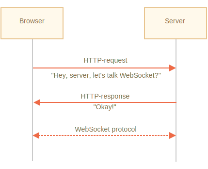

# WebSocket

Le protocole `WebSocket`, décrit dans la spécification [RFC 6455](http://tools.ietf.org/html/rfc6455) fournit un moyen d'échanger des données entre le navigateur et le serveur via une connexion persistante. Les données peuvent être transmises dans les deux sens sous forme de "paquets", sans interrompre la connexion et les requêtes HTTP supplémentaires.

WebSocket est particulièrement adapté aux services qui nécessitent un échange de données continu, par exemple jeux en ligne, systèmes de trading en temps réel, etc.

## Un exemple simple

Pour ouvrir une connexion websocket, nous devons créer `new WebSocket` en utilisant le protocole spécial `ws` dans l'url :

```js
let socket = new WebSocket("*!*ws*/!*://javascript.info");
```

Il existe également un protocole chiffré `wss://`. C'est comme HTTPS mais pour les websockets.

<<<<<<< HEAD
```smart header="Toujours préférer `wss://`"
Le protocole `wss://` est non seulement chiffré, mais également plus fiable.
=======
```smart header="Always prefer `wss://`"
The `wss://` protocol is not only encrypted, but also more reliable.
>>>>>>> cdf382de4cf3ed39ca70cb7df60c4c4886f2d22e

C'est parce que les données `ws://` ne sont pas chiffrées, par conséquent visibles pour tout intermédiaire. Les anciens serveurs proxy ne connaissent pas WebSocket, ils peuvent voir des en-têtes "étranges" et abandonner la connexion.

D'un autre côté, `wss://` est WebSocket sur TLS, (comme HTTPS est HTTP sur TLS), la couche de sécurité de transport chiffre les données à l'expéditeur et déchiffre au récepteur. Les paquets de données sont donc transmis chiffrés via des proxys. Ils ne peuvent pas voir ce qu'il y a à l'intérieur et les laisser passer.
```

Une fois le socket créé, nous devons écouter les événements qu'il contient. Il y a au total 4 événements :
- **`open`** -- Connection établie,
- **`message`** -- Donnée reçue,
- **`error`** -- erreur websocket,
- **`close`** -- connexion fermée.

… Et si nous souhaitons envoyer quelque chose, alors `socket.send(data)` fera cela.

Voici un exemple :

```js run
let socket = new WebSocket("wss://javascript.info/article/websocket/demo/hello");

socket.onopen = function(e) {
  alert("[open] Connection established");
  alert("Sending to server");
  socket.send("My name is John");
};

socket.onmessage = function(event) {
  alert(`[message] Data received from server: ${event.data}`);
};

socket.onclose = function(event) {
  if (event.wasClean) {  
    alert(`[close] Connection closed cleanly, code=${event.code} reason=${event.reason}`);
  } else {
    // par exemple : processus serveur arrêté ou réseau en panne
    // event.code est généralement 1006 dans ce cas
    alert('[close] Connection died');
  }
};

socket.onerror = function(error) {
  alert(`[error] ${error.message}`);
};
```

À des fins de démonstration, il y a un petit serveur [server.js](demo/server.js) écrit en Node.js, pour l'exemple ci-dessus, en cours d'exécution. Il répond par "Bonjour du serveur, John", puis attend 5 secondes et ferme la connexion.

Vous verrez donc les événements `open` -> `message` -> `close`.

On peut déjà parler de WebSocket. C'est assez simple, non ?

Approfondissont maintenant.

## Ouvrir un websocket

Lorsque `new WebSocket(url)` est créé, il se connecte immédiatement.

Lors de la connexion, le navigateur (à l'aide des en-têtes) demande au serveur: "Prenez-vous en charge Websocket ?" Et si le serveur répond "oui", alors la conversation se poursuit dans le protocole WebSocket, qui n'est pas du tout HTTP.



Voici un exemple d'en-têtes de navigateur pour une demande faite par `new WebSocket("wss://javascript.info/chat")`.

```
GET /chat
Host: javascript.info
Origin: https://javascript.info
Connection: Upgrade
Upgrade: websocket
Sec-WebSocket-Key: Iv8io/9s+lYFgZWcXczP8Q==
Sec-WebSocket-Version: 13
```

- `Origin` -- l'origine de la page client, par exemple `https://javascript.info`. Les objets WebSocket sont cross-origin par nature. Il n'y a pas d'en-têtes spéciaux ou d'autres limitations. Les anciens serveurs ne sont pas en mesure de gérer WebSocket de toute façon, il n'y a donc pas de problème de compatibilité. Mais l'en-tête `Origin` est important, car il permet au serveur de décider de discuter ou non en WebSocket avec ce site Web.
- `Connection: Upgrade` -- indique que le client souhaite modifier le protocole.
- `Upgrade: websocket` -- le protocole demandé est "websocket".
- `Sec-WebSocket-Key` -- une clé générée aléatoirement par le navigateur pour la sécurité.
- `Sec-WebSocket-Version` -- Version du protocole WebSocket, 13 est la version actuelle.

```smart header="Le handshake WebSocket ne peut pas être émulé"
Nous ne pouvons pas utiliser `XMLHttpRequest` ou` fetch` pour effectuer ce type de requête HTTP, car JavaScript n'est pas autorisé à définir ces en-têtes.
```

Si le serveur accepte de passer à WebSocket, il doit envoyer le code de réponse 101 :

```
101 Switching Protocols
Upgrade: websocket
Connection: Upgrade
Sec-WebSocket-Accept: hsBlbuDTkk24srzEOTBUlZAlC2g=
```

Ici `Sec-WebSocket-Accept` est `Sec-WebSocket-Key`, recodé à l'aide d'un algorithme spécial. Le navigateur l'utilise pour s'assurer que la réponse correspond à la requête.

Ensuite, les données sont transférées en utilisant le protocole WebSocket, nous verrons bientôt sa structure ("frames"). Et ce n'est pas du tout HTTP.

### Extensions et sous-protocoles

Il peut y avoir des en-têtes supplémentaires `Sec-WebSocket-Extensions` et `Sec-WebSocket-Protocol` qui décrivent les extensions et les sous-protocoles.

Par exemple :

- `Sec-WebSocket-Extensions: deflate-frame` signifie que le navigateur prend en charge la compression des données. Une extension est liée au transfert des données, c'est une fonctionnalité qui étend le protocole WebSocket. L'en-tête `Sec-WebSocket-Extensions` est envoyé automatiquement par le navigateur, avec la liste de toutes les extensions qu'il prend en charge.

- `Sec-WebSocket-Protocol: soap, wamp` signifie que nous aimerions transférer non seulement toutes les données, mais les données [SOAP](http://en.wikipedia.org/wiki/SOAP) ou les protocoles WAMP ("The WebSocket Application Messaging Protocol"). Les sous-protocoles WebSocket sont enregistrés dans le [catalogue IANA](http://www.iana.org/assignments/websocket/websocket.xml). Donc, cet en-tête décrit les formats de données que nous allons utiliser.

    Cet en-tête facultatif est défini à l'aide du deuxième paramètre de `new WebSocket`. C'est le tableau des sous-protocoles, par exemple si nous souhaitons utiliser SOAP ou WAMP :

    ```js
    let socket = new WebSocket("wss://javascript.info/chat", ["soap", "wamp"]);
    ```

Le serveur doit répondre avec une liste de protocoles et d'extensions qu'il accepte d'utiliser.

Par exemple, la requête :

```
GET /chat
Host: javascript.info
Upgrade: websocket
Connection: Upgrade
Origin: https://javascript.info
Sec-WebSocket-Key: Iv8io/9s+lYFgZWcXczP8Q==
Sec-WebSocket-Version: 13
*!*
Sec-WebSocket-Extensions: deflate-frame
Sec-WebSocket-Protocol: soap, wamp
*/!*
```

Réponse :

```
101 Switching Protocols
Upgrade: websocket
Connection: Upgrade
Sec-WebSocket-Accept: hsBlbuDTkk24srzEOTBUlZAlC2g=
*!*
Sec-WebSocket-Extensions: deflate-frame
Sec-WebSocket-Protocol: soap
*/!*
```

Ici, le serveur répond qu'il prend en charge l'extension "deflate-frame", et uniquement SOAP des sous-protocoles demandés.

## Transfert de données

La communication WebSocket se compose de "frames" -- des fragments de données, qui peuvent être envoyés de chaque côté et peuvent être de plusieurs types :

- "text frames" -- contiennent des données textuelles que les parties s'envoient mutuellement.
- "binary data frames" -- contiennent des données binaires que les parties s'envoient mutuellement.
- "ping/pong frames" sont utilisés pour vérifier la connexion, envoyée par le serveur, le navigateur y répond automatiquement.
- il y a aussi la "connection close frame" et quelques autres frames de service.

Dans le navigateur, nous travaillons directement uniquement avec du texte ou des frames binaires.

**La méthode WebSocket `.send()` peut envoyer du texte ou des données binaires.**

Un appel `socket.send(body)` autorise `body` dans une chaîne de caractères ou un format binaire, y compris `Blob`, `ArrayBuffer`, etc. Aucun paramètre requis : il suffit de l'envoyer dans n'importe quel format.

**Lorsque nous recevons les données, le texte vient toujours sous forme de chaîne de caractères. Et pour les données binaires, nous pouvons choisir entre les formats `Blob` et `ArrayBuffer`.**

Cela est défini par la propriété `socket.bufferType`, c'est `"blob"` par défaut, donc les données binaires viennent en tant qu'objets `Blob`.

[Blob](info:blob) est un objet binaire de haut niveau, il s'intègre directement avec `<a>`, `` et d'autres balises, c'est donc un défaut sain. Mais pour le traitement binaire, pour accéder aux octets de données individuels, nous pouvons le changer en `"arraybuffer"` :

```js
socket.bufferType = "arraybuffer";
socket.onmessage = (event) => {
  // event.data est soit une chaîne de caractères (si du texte), soit un arraybuffer (si binaire)
};
```

## Limitation de débit

Imaginez, notre application génère beaucoup de données à envoyer. Mais l'utilisateur a une connexion réseau lente, peut-être sur un Internet mobile, en dehors d'une ville.

Nous pouvons appeler `socket.send (data)` encore et encore. Mais les données seront mises en mémoire tampon (stockées) en mémoire et envoyées uniquement aussi rapidement que la vitesse du réseau le permet.

La propriété `socket.bufferedAmount` stocke le nombre d'octets qui sont mis en mémoire tampon à ce moment, en attente d'être envoyés sur le réseau.

Nous pouvons l'examiner pour voir si le socket est réellement disponible pour la transmission.

```js
// toutes les 100 ms examine le socket et envoi plus de données
// uniquement si toutes les données existantes ont été envoyées
setInterval(() => {
  if (socket.bufferedAmount == 0) {
    socket.send(moreData());
  }
}, 100);
```


## Connexion fermée

Normalement, lorsqu'une partie souhaite fermer la connexion (le navigateur et le serveur ont les mêmes droits), ils envoient un "connection close frame" avec un code numérique et une raison textuelle.

La méthode pour cela est :
```js
socket.close([code], [reason]);
```

- `code` est un code de fermeture WebSocket spécial (facultatif)
- `reason` est une chaîne de caractères qui décrit la raison de la fermeture (facultatif)

Ensuite, l'autre partie du gestionnaire d'événements `close` obtient le code et la raison, par exemple :

```js
// partie fermante :
socket.close(1000, "Work complete");

// l'autre partie
socket.onclose = event => {
  // event.code === 1000
  // event.reason === "Work complete"
  // event.wasClean === true (clean close)
};
```

Valeurs de code les plus courantes :

- `1000` -- la fermeture normale par défaut (utilisée si aucun `code` n'est fourni),
- `1006` -- aucun moyen pour utiliser ce code manuellement, indique que la connexion a été perdue (pas de frame de fermeture).

Il existe d'autres codes comme :

- `1001` -- la partie s'en va, par exemple le serveur s'arrête ou un navigateur quitte la page,
- `1009` -- le message est trop gros pour être traité,
- `1011` -- erreur inattendue sur le serveur,
- … etc.

La liste complète se trouve dans le [RFC6455, §7.4.1](https://tools.ietf.org/html/rfc6455#section-7.4.1).

Les codes WebSocket sont un peu comme les codes HTTP, mais différents. En particulier, tous les codes inférieurs à `1000` sont réservés, il y aura une erreur si nous essayons de définir un tel code.

```js
// en cas de rupture de connexion
socket.onclose = event => {
  // event.code === 1006
  // event.reason === ""
  // event.wasClean === false (no closing frame)
};
```


## État de connexion

Pour obtenir l'état de la connexion, il existe en outre la propriété `socket.readyState` avec des valeurs :

- **`0`** -- "CONNECTING": la connexion n'a pas encore été établie,
- **`1`** -- "OPEN": communicante,
- **`2`** -- "CLOSING": la connexion se ferme,
- **`3`** -- "CLOSED": la connexion est fermée.


## Exemple de tchat

Passons en revue un exemple de discussion à l'aide de l'API WebSocket du navigateur et du module Node.js WebSocket <https://github.com/websockets/ws>. Nous porterons notre attention principalement sur le côté client, mais le serveur est également simple.

HTML: nous avons besoin d'un `<form>` pour envoyer des messages et d'un `<div>` pour les messages entrants :

```html
<!-- message form -->
<form name="publish">
  <input type="text" name="message">
  <input type="submit" value="Send">
</form>

<!-- div with messages -->
<div id="messages"></div>
```

De JavaScript, nous voulons trois choses :
1. Ouvrir la connexion.
2. Lors de la soumission du formulaire - `socket.send(message)` pour le message.
3. Sur le message entrant - l'ajouter à `div#messages`.

Voici le code :

```js
let socket = new WebSocket("wss://javascript.info/article/websocket/chat/ws");

// envoyer un message depuis le formulaire
document.forms.publish.onsubmit = function() {
  let outgoingMessage = this.message.value;

  socket.send(outgoingMessage);
  return false;
};

// message reçu - affiche le message dans div#messages
socket.onmessage = function(event) {
  let message = event.data;

  let messageElem = document.createElement('div');
  messageElem.textContent = message;
  document.getElementById('messages').prepend(messageElem);
}
```

Le code côté serveur dépasse un peu notre portée. Ici, nous utiliserons Node.js, mais ce n'est pas obligatoire. D'autres plateformes ont également leurs moyens de travailler avec WebSocket.

L'algorithme côté serveur sera :

1. Créer `clients = new Set()` -- un ensemble de sockets.
2. Pour chaque websocket accepté, l'ajouter à l'ensemble `clients.add (socket)` et configurer l'écouteur d'événements `message` pour obtenir ses messages.
3. Lorsqu'un message est reçu : parcourir les clients et l'envoyer à tout le monde.
4. Lorsqu'une connexion est fermée : `clients.delete(socket)`.

```js
const ws = new require('ws');
const wss = new ws.Server({noServer: true});

const clients = new Set();

http.createServer((req, res) => {
  // ici, nous ne gérons que les connexions websocket
  // dans un projet réel, nous aurions un autre code ici pour gérer les demandes non Websocket
  wss.handleUpgrade(req, req.socket, Buffer.alloc(0), onSocketConnect);
});

function onSocketConnect(ws) {
  clients.add(ws);

  ws.on('message', function(message) {
    message = message.slice(0, 50); // la longueur maximale des messages sera de 50

    for(let client of clients) {
      client.send(message);
    }
  });

  ws.on('close', function() {
    clients.delete(ws);
  });
}
```


Voici l'exemple fonctionnel :

[iframe src="chat" height="100" zip]

Vous pouvez également le télécharger (bouton en haut à droite dans l'iframe) et l'exécuter localement. N'oubliez pas d'installer [Node.js](https://nodejs.org/en/) et `npm install ws` avant l'exécution.

## Résumé

WebSocket est un moyen moderne d'avoir des connexions navigateur-serveur persistantes.

- WebSockets n'ont pas de limites cross-origin.
- Ils sont bien pris en charge dans les navigateurs.
- Peut envoyer/recevoir des chaînes de caractères et des données binaires.

L'API est simple.

Les méthodes :
- `socket.send(data)`,
- `socket.close([code], [reason])`.

Les événements :
- `open`,
- `message`,
- `error`,
- `close`.

WebSocket ne comprend pas à lui seul la reconnexion, l'authentification et de nombreux autres mécanismes de haut niveau. Il existe donc des bibliothèques client / serveur pour cela, et il est également possible d'implémenter ces capacités manuellement.

Parfois, pour intégrer WebSocket dans un projet existant, les gens exécutent le serveur WebSocket en parallèle avec le serveur HTTP principal et partagent une seule base de données. Les requêtes à WebSocket utilisent `wss://ws.site.com`, un sous-domaine qui mène au serveur WebSocket, tandis que` https://site.com` va au serveur HTTP principal.

Certes, d'autres modes d'intégration sont également possibles.
