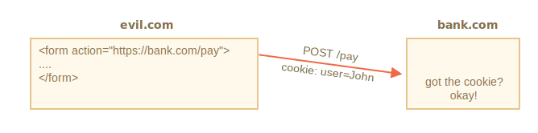
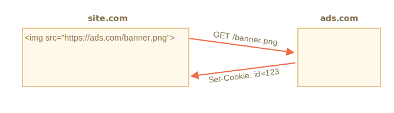
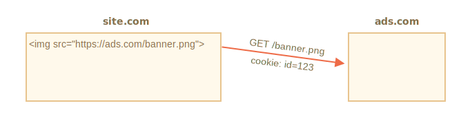
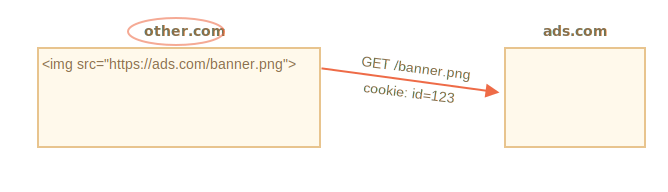

# Cookies, document.cookie

Les cookies sont des donnés stockées sous forme de petites chaîne de caractères directement dans le navigateur. Ils font parti du protocole HTTP, ils sont définis par la spécification [RFC 6265](https://tools.ietf.org/html/rfc6265).

<<<<<<< HEAD
Les cookies sont en général définis par le serveur web en utilisant l'entête HTTP `Set-Cookie`. Alors, le navigateur les ajoutent automatiquement à (presque) toutes les requêtes provenant du même domaine en utilisant l'entête HTTP `Cookie`.
=======
Cookies are usually set by a web server using the response `Set-Cookie` HTTP header. Then, the browser automatically adds them to (almost) every request to the same domain using the `Cookie` HTTP header.
>>>>>>> 1dce5b72b16288dad31b7b3febed4f38b7a5cd8a

L'un des cas d'utilisation les plus répandus est l'authentification :

<<<<<<< HEAD
1. Une fois connecté, le serveur utilise l'entête HTTP `Set-Cookie` dans la réponse pour définir un cookie avec un "identifiant de session" unique.
2. La prochaine fois lorsque la requête est envoyée au même domaine, le navigateur envoie le cookie sur le réseau en utilisant l'entête HTTP `Cookie`.
3. Alors le serveur sait qui a fait la requête.
=======
1. Upon sign-in, the server uses the `Set-Cookie` HTTP header in the response to set a cookie with a unique "session identifier".
2. Next time the request is sent to the same domain, the browser sends the cookie over the net using the `Cookie` HTTP header.
3. So the server knows who made the request.
>>>>>>> 1dce5b72b16288dad31b7b3febed4f38b7a5cd8a

Nous pouvons aussi accéder aux cookies depuis le navigateur, en utilisant la propriété `document.cookie`.

<<<<<<< HEAD
Il y a beaucoup de chose malignes à faire à propos des cookies et leurs options. Dans ce chapitre nous les couvrirons en détail.
=======
There are many tricky things about cookies and their attributes. In this chapter, we'll cover them in detail.
>>>>>>> 1dce5b72b16288dad31b7b3febed4f38b7a5cd8a

## Lire depuis document.cookie

```online
Votre navigateur stocke t-il des cookies depuis ce site ? Voyons voir :
```

```offline
En considérant que vous êtes sur un site web, il est possible de voir ses cookies, comme ceci :
```

```js run
// Sur javascript.info, nous utilisons Google Analytics pour les statistiques,
// Donc il devrait y avoir quelques cookies
alert( document.cookie ); // cookie1=value1; cookie2=value2;...
```

La valeur de `document.cookie` consiste en des paires `name=value`, délimitées par `; `. Chacune étant un cookie séparé.

<<<<<<< HEAD
Pour trouver un cookie en particulier, nous pouvons diviser `document.cookie` par `; `, et donc trouver le bon nom. Nous pouvons utiliser soit une expression régulière (regex) ou des fonctions de tableau pour faire cela.

Nous laissons cela en tant qu'exercice pour le lecteur. Aussi, à la fin du chapitre vous trouverez des fonctions utilitaires pour manipuler les cookies.

## Écrire dans document.cookie
=======
The value of `document.cookie` consists of `name=value` pairs, delimited by `; `. Each one is a separate cookie.

To find a particular cookie, we can split `document.cookie` by `; `, and then find the right name. We can use either a regular expression or array functions to do that.

We leave it as an exercise for the reader. Also, at the end of the chapter, you'll find helper functions to manipulate cookies.
>>>>>>> 1dce5b72b16288dad31b7b3febed4f38b7a5cd8a

Nous pouvons écrire dans `document.cookie`. Mais ce n'est pas une propriété de données, c'est un [accesseur (getter/setter)](info:property-accessors). Une affectation à ce dernier est traitée spécialement.

**Une opération d'écriture dans `document.cookie` met à jour seulement les cookies mentionnés dedans, mais ne touche pas les autres cookies.**

<<<<<<< HEAD
Par exemple, cet appel définit un cookie avec le nom `user` et la valeur `John` :
=======
**A write operation to `document.cookie` updates only the cookie mentioned in it and doesn't touch other cookies.**

For instance, this call sets a cookie with the name `user` and value `John`:
>>>>>>> 1dce5b72b16288dad31b7b3febed4f38b7a5cd8a

```js run
document.cookie = "user=John"; // Met à jour uniquement le cookie nommé 'user'
alert(document.cookie); // Affiche tous les cookies
```

<<<<<<< HEAD
Si vous exécutez cela, vous verrez probablement plusieurs cookies. Car l'opération `document.cookie=` ne réécrit pas tous les cookies. Elle définit uniquement le cookie `user` mentionné.
=======
If you run it, you will likely see multiple cookies. That's because the `document.cookie=` operation does not overwrite all cookies. It only sets the mentioned cookie `user`.
>>>>>>> 1dce5b72b16288dad31b7b3febed4f38b7a5cd8a

Techniquement, le nom et la valeur peuvent être n'importe quel caractère. Pour garder le formattage valide, ils devraient être échappés en utilisant la fonction integrée `encodeURIComponent` :

```js run
<<<<<<< HEAD
// Les caractères spéciaux ont besoin d'encodage
=======
// special characters (spaces) need encoding
>>>>>>> 1dce5b72b16288dad31b7b3febed4f38b7a5cd8a
let name = "my name";
let value = "John Smith"

// Encode le cookie en tant que my%20name=John%20Smith
document.cookie = encodeURIComponent(name) + '=' + encodeURIComponent(value);

alert(document.cookie); // ...; my%20name=John%20Smith
```

```warn header="Limitations"
<<<<<<< HEAD
Il y a quelques limites :
- La paire `name=value`, après `encodeURIComponent`, ne peut pas excéder 4KB. Donc on ne peut pas stocker quelque chose de trop lourd sur un cookie.
- Le nombre total de cookie par domaine est limité à ~ 20+, la limite exacte dépend du navigateur.
```

Les cookies ont plusieurs options, beaucoup d'entre elles sont importantes et devraient être définies.

Les options sont listées après `key=value`, délimité par `;`, comme ceci :
=======
There are a few limitations:
- You can only set/update a single cookie at a time using `document.cookie`.
- The `name=value` pair, after `encodeURIComponent`, should not exceed 4KB. So we can't store anything huge in a cookie.
- The total number of cookies per domain is limited to around 20+, the exact limit depends on the browser.
```

Cookies have several attributes, many of which are important and should be set.

The attributes are listed after `key=value`, delimited by `;`, like this:
>>>>>>> 1dce5b72b16288dad31b7b3febed4f38b7a5cd8a

```js run
document.cookie = "user=John; path=/; expires=Tue, 19 Jan 2038 03:14:07 GMT"
```

<<<<<<< HEAD
## path

- **`path=/mypath`**

Le préfix du chemin de l'URL doit être absolu. Ça rend le cookie accessible pour les pages du même chemin. Par défaut, il s'agit du chemin courant.

Si un cookie est défini avec `path=/admin`, il est visible aux pages `/admin` et `/admin/something`, mais pas à `/home` ou `/adminpage`.

Généralement, nous devons définir `path` à la racine `path=/` pour rendre le cookie accessible depuis toutes les pages du site.

=======
>>>>>>> 1dce5b72b16288dad31b7b3febed4f38b7a5cd8a
## domain

- **`domain=site.com`**

Un domaine définit par où le cookie est accessible. Cependant en pratique, il y a des limites. Nous ne pouvons pas définir n'importe quel domaine.

**Il n'y a pas de moyen de laisser un cookie être accessible depuis un domaine de second niveau, donc `other.com` ne recevra jamais un cookie défini à `site.com`**

Il s'agit d'une restriction de sécurité, pour nous permettre de stocker des données sensibles dans nos cookies qui ne seront disponibles que sur un site.

Par défaut, un cookie est accessible uniquement depuis le domaine qui l'a défini.

<<<<<<< HEAD
Veuillez noter, par défaut un cookie n'est pas partagé avec un sous-domaine, tel que `forum.site.com`.
=======
Please note, by default, a cookie is not shared with a subdomain, such as `forum.site.com`.
>>>>>>> 1dce5b72b16288dad31b7b3febed4f38b7a5cd8a

```js
// Si nous définissons un cookie sur site.com
document.cookie = "user=John"

// ...Nous ne le verrons pas depuis forum.site.com
alert(document.cookie); // no user
```

...Mais cela peut changer. Si nous aimerions permettre aux sous-domaines comme `forum.site.com` de récupérer un cookie défini par `site.com`, c'est possible.

<<<<<<< HEAD
Pour que cela arrive, quand nous definissons un cookie depuis `site.com`, nous pouvons définir l'option `domain` à la racine du domaine : `domain=site.com`. Alors tous les sous-domaines verront un tel cookie.
=======
For that to happen, when setting a cookie at `site.com`, we should explicitly set the `domain` attribute to the root domain: `domain=site.com`. Then all subdomains will see such a cookie.
>>>>>>> 1dce5b72b16288dad31b7b3febed4f38b7a5cd8a

Par exemple :

```js
// Depuis site.com
// Rendre le cookie accessible à tous les sous-domaines *.site.com:
document.cookie = "user=John; *!*domain=site.com*/!*"

// Plus tard

// Depuis forum.site.com
alert(document.cookie); // Le cookie user=John existe
```

<<<<<<< HEAD
Pour des raisons historiques, `domain=.site.con` (avec un point avant `site.com`) fonctionne de la même manière, permettant l'accés au cookie depuis les sous-domaines. C'est une vielle notation et devrait être utilisée si nous avons besoin de prendre en charge les très vieux navigateurs.

Pour résumer, l'option `domain` permet de rendre un cookie accessible aux sous-domaines.

## expires, max-age

Par défaut, si un cookie n'a pas ces options, il disparait quand le navigateur est fermé. De tels cookies sont appellés "cookies de session"

Pour laisser les cookies survivre à la fermeture du navigateur, nous pouvons soit définir soit l'option `expires` ou `max-age`.

- **`expires=Tue, 19 Jan 2038 03:14:07 GMT`**

La date d'expiration du cookie définit la date, à laquelle le navigateur le supprimera automatiquement.
=======
```warn header="Legacy syntax"
Historically, `domain=.site.com` (with a dot before `site.com`) used to work the same way, allowing access to the cookie from subdomains. Leading dots in domain names are now ignored, but some browsers may decline to set the cookie containing such dots.
```

To summarize, the `domain` attribute allows to make a cookie accessible at subdomains.

## path

- **`path=/mypath`**

The URL path prefix must be absolute. It makes the cookie accessible for pages under that path. By default, it's the current path.

If a cookie is set with `path=/admin`, it's visible on pages `/admin` and `/admin/something`, but not at `/home`, `/home/admin` or `/`.

Usually, we should set `path` to the root: `path=/` to make the cookie accessible from all website pages. If this attribute is not set the default is calculated using [this method](https://developer.mozilla.org/en-US/docs/Web/HTTP/Cookies#path_default_value).

## expires, max-age

By default, if a cookie doesn't have one of these attributes, it disappears when the browser/tab is closed. Such cookies are called "session cookies"

To let cookies survive a browser close, we can set either the `expires` or `max-age` attribute. `max-Age` has precedence if both are set.

- **`expires=Tue, 19 Jan 2038 03:14:07 GMT`**

The cookie expiration date defines the time when the browser will automatically delete it (according to the browser's time zone).
>>>>>>> 1dce5b72b16288dad31b7b3febed4f38b7a5cd8a

La date doit être exactement dans ce format, en timezone GMT. Nous pouvons utiliser `date.toUTCString` pour le récupérer. Par exemple, nous pouvons définir le cookie pour qu'il expire dans 1 jour :

```js
// +1 jour depuis maintenant
let date = new Date(Date.now() + 86400e3);
date = date.toUTCString();
document.cookie = "user=John; expires=" + date;
```

Si nous définissons `expires` à une date dans le passé, le cookie est supprimé.

- **`max-age=3600`**

Il s'agit d'une alternative à `expires` et elle spécifie l'expiration du cookie en seconde à partir de l'instant.

Si elle est définie à zero ou une valeur négative, le cookie sera supprimé :

```js
// Le cookie mourra dans +1 heure à partir de maintenant
document.cookie = "user=John; max-age=3600";

// Supprime le cookie (le laisser expirer tout de suite)
document.cookie = "user=John; max-age=0";
```

## secure

- **`secure`**

Le cookie devrait être transféré seulement avec HTTPS.

**Par défaut, si nous définissons un cookie à `http://site.com`, alors il apparaitra aussi à `https://site.com` et vice versa.**

Les cookies sont "domain-based", ils ne sont pas distinguables entre les protocoles.

<<<<<<< HEAD
Avec cette option, si un cookie est défini par `https://site.com`, alors il n'apparait pas quand le même site est accédé par HTTP, comme `http://site.com`. Donc si un cookie a un contenu sensible il ne devrait pas être envoyé sur HTTP qui n'est chiffré, le flag `secure` est la bonne chose.
=======
With this attribute, if a cookie is set by `https://site.com`, then it doesn't appear when the same site is accessed by HTTP, as `http://site.com`. So if a cookie has sensitive content that should never be sent over unencrypted HTTP, the `secure` flag is the right thing.
>>>>>>> 1dce5b72b16288dad31b7b3febed4f38b7a5cd8a

```js
// Considérons que nous soyons sur https:// maintenant
// Définit le cookie pour être sécurisé (seulement accessible par HTTPS)
document.cookie = "user=John; secure";
```

## samesite

<<<<<<< HEAD
Il s'agit d'un nouvel attribut de sécurité `samesite`. Il a été conçu pour protéger de ce qu'on appelle attaques XSRF (cross-site request forgery).
=======
This is another security attribute `samesite`. It's designed to protect from so-called XSRF (cross-site request forgery) attacks.
>>>>>>> 1dce5b72b16288dad31b7b3febed4f38b7a5cd8a

## L'attaque XSRF

Imaginez, vous êtes connecté sur le site `bank.com`. Ce qui signifie : que vous avez un cookie d'authentification sur ce site. Votre navigateur l'envoie à `bank.com` à chaque requête, donc il vous reconnait et effectue toutes les opérations financières sensibles.

<<<<<<< HEAD
Maintenant, pendant que vous naviguez sur le web dans une autre fenêtre, vous arrivez accidentellement sur un autre site `evil.com`. Ce site a du code JavaScript qui soumet un formulaire `<form action="https://bank.com/pay">` à `bank.com` avec les champs qui initient une transaction avec le compte du hacker.

Le navigateur envoie des cookies à chaque fois que vous visitez le site `bank.com`, même si le formulaire a été envoyé depuis `evil.com`. Donc la banque vous reconnait et effectue le paiement.



C'est ce qu'on appelle une attaque "Cross-Site Request Forgery" (XSRF en plus court).

Les vraies banques en sont évidemment protégées. Tous les formulaires générés par `bank.com` ont un champ spécial, un certain "XSRF protection token", qu'une page malveillante ne peut pas générer ou extraire de la page distante. Elle peut y soumettre un formulaire, mais pas récupérer les données. Le site `bank.com` vérifie ce genre de token dans tous les formulaires qu'il reçoit.
=======
Imagine, you are logged into the site `bank.com`. That is: you have an authentication cookie from that site. Your browser sends it to `bank.com` with every request so that it recognizes you and performs all sensitive financial operations.

Now, while browsing the web in another window, you accidentally come to another site `evil.com`. That site has JavaScript code that submits a form `<form action="https://bank.com/pay">` to `bank.com` with fields that initiate a transaction to the hacker's account.

The browser sends cookies every time you visit the site `bank.com`, even if the form was submitted from `evil.com`. So the bank recognizes you and performs the payment.


This is a so-called "Cross-Site Request Forgery" (in short, XSRF) attack.

Real banks are protected from it of course. All forms generated by `bank.com` have a special field, a so-called "XSRF protection token", that an evil page can't generate or extract from a remote page. It can submit a form there, but can't get the data back. The site `bank.com` checks for such a token in every form it receives.
>>>>>>> 1dce5b72b16288dad31b7b3febed4f38b7a5cd8a

Une telle protection prend du temps à mettre en œuvre cependant. Nous avons besoin de nous assurer que tous les formulaires ont le champ de token requis, et nous devons aussi vérifier toutes les requêtes.

<<<<<<< HEAD
### Entrer un cookie avec l'option samesite

L'option `samesite` de cookie fournit un autre moyen de se protéger de telles attaques, cela ne devrait (en théorie) pas nécessiter de "tokens de protections xsrf".
=======
### Use cookie samesite attribute

The cookie `samesite` attribute provides another way to protect from such attacks, that (in theory) should not require "xsrf protection tokens".
>>>>>>> 1dce5b72b16288dad31b7b3febed4f38b7a5cd8a

Elle a deux valeurs possible :

<<<<<<< HEAD
- **`samesite=strict` (pareil que `samesite` sans valeur)**
=======
- **`samesite=strict`**
>>>>>>> 1dce5b72b16288dad31b7b3febed4f38b7a5cd8a

Un cookie avec `samesite=strict` n'est jamais envoyé si un utilisateur vient d'en dehors du même site.

<<<<<<< HEAD
En d'autres termes, qu'importe que l'utilisateur suive un lien de ses mails ou soumette un formulaire provenant d'`evil.com`, ou qu'il fasse des opérations provenants d'un autre domaine, le cookie n'est pas envoyé.

Si le cookie d'authentification a l'option `samesite`, alors l'attaque XSRF n'a aucune chance de se solder par un succés, car une soumission depuis `evil.com` ne vient pas avec les cookies. Donc `bank.com` ne reconnaitra pas l'utilisateur et ne procédera pas au paiement.

La protection est plutôt fiable. Seules les opérations provenants de `bank.com` vont envoyer le cookie `samesite`, e.g. une soumission de formulaire depuis une autre page à `bank.com`.
=======
In other words, whether a user follows a link from their email, submits a form from `evil.com`, or does any operation that originates from another domain, the cookie is not sent.

If authentication cookies have the `samesite=strict` attribute, then an XSRF attack has no chance of succeeding, because a submission from `evil.com` comes without cookies. So `bank.com` will not recognize the user and will not proceed with the payment.

The protection is quite reliable. Only operations that come from `bank.com` will send the `samesite=strict` cookie, e.g. a form submission from another page at `bank.com`.
>>>>>>> 1dce5b72b16288dad31b7b3febed4f38b7a5cd8a

Bien que, il y ait un petit inconvénient.

<<<<<<< HEAD
Quand un utilisateur suit un lien légitime vers `bank.com`, comme depuis ses propres notes, il sera surpris que `bank.com` ne le reconnaisse pas. En effet, les cookies `samesite=strict` ne sont pas envoyés dans ce cas.

Nous pouvons contourner ça avec deux cookies : une pour la "reconnaissance générale", uniquement dans le but de dire : "Salut, John", et un autre pour les opérations de changements de données avec `samesite=strict`. Alors, une personne venant de l'extérieur du site verra un message de bienvenue, mais les paiements devront être initiés depuis le site de la banque, pour que le second cookie soit envoyé.
=======
When a user follows a legitimate link to `bank.com`, like from their notes, they'll be surprised that `bank.com` does not recognize them. Indeed, `samesite=strict` cookies are not sent in that case.

We could work around that by using two cookies: one for "general recognition", only to say: "Hello, John", and the other one for data-changing operations with `samesite=strict`. Then, a person coming from outside of the site will see a welcome, but payments must be initiated from the bank's website, for the second cookie to be sent.
>>>>>>> 1dce5b72b16288dad31b7b3febed4f38b7a5cd8a

- **`samesite=lax` (same as `samesite` without value)**

Une approche plus relax qui protège aussi des XSRF et qui n'entrave pas l'expérience utilisateur.

Le mode lax, tout comme `strict`, interdit au navigateur d'envoyer des cookies quand venu de l'extérieur du site, mais ajoute une exception.

Un cookie `samesite=lax` est envoyé lorsque deux conditions sont réunies :

<<<<<<< HEAD
1. La méthode HTTP est "safe" (e.g. GET, mais pas POST).
=======
    The full list of safe HTTP methods is in the [RFC7231 specification](https://tools.ietf.org/html/rfc7231#section-4.2.1). These are the methods that should be used for reading, but not writing the data. They must not perform any data-changing operations. Following a link is always GET, the safe method.
>>>>>>> 1dce5b72b16288dad31b7b3febed4f38b7a5cd8a

  La liste complète des méthodes HTTP safes est dans la [spécification RFC7231](https://tools.ietf.org/html/rfc7231). Basiquement ce sont des méthodes qui peuvent être utilisées pour lire, mais pas pour écrire de données. Elles ne doivent pas effectuer d'opérations de modifications de données. Suivre un lien c'est toujours du GET, la méthode safe.

<<<<<<< HEAD
2. L'opération effectue une navigation de haut niveau (change l'URL dans la barre d'adresse).

  C'est généralement vrai, mais si la navigation est effectuée dans une `<iframe>`, alors ce n'est pas du haut-niveau. Aussi, les méthodes JavaScript n'effectuent aucune navigation, alors elles ne conviennent pas.
=======
    This is usually true, but if the navigation is performed in an `<iframe>`, then it is not top-level. Additionally, JavaScript methods for network requests do not perform any navigation.

So, what `samesite=lax` does, is to allow the most common "go to URL" operation to have cookies. E.g. opening a website link from notes that satisfy these conditions.
>>>>>>> 1dce5b72b16288dad31b7b3febed4f38b7a5cd8a

Donc, que fait `samesite=lax`, il permet les opérations basiques "va à l'URL" à avoir des cookies. E.g. ouvrir un lien depuis des notes satisfait ces conditions.

Mais quelque chose de plus compliqué, comme une requête depuis un autre site ou une soumission de formulaire, perd les cookies.

<<<<<<< HEAD
Si cela vous convient, alors ajouter `samesite=lax` n'entravera probablement pas l'expérience utilisateur et ajoutera une protection.
=======
Overall, `samesite` is a great attribute.
>>>>>>> 1dce5b72b16288dad31b7b3febed4f38b7a5cd8a

Dans l'ensemble, `samesite` est une bonne option.

<<<<<<< HEAD
Il y a un inconvénient :
=======
- `samesite` is ignored (not supported) by very old browsers, the year 2017 or so.
>>>>>>> 1dce5b72b16288dad31b7b3febed4f38b7a5cd8a

- `samesite` est ignoré (non supporté) par les très vieux navigateurs, datant de 2017 et avant.

<<<<<<< HEAD
**Donc si nous comptions uniquement sur `samesite` pour fournir une protection, alors les anciens navigateurs seraient vulnérables.**

Mais nous pouvons assurément utiliser `samesite` avec d'autres mesures de protections, comme les tokens xsrf, pour ajouter une couche de défense additionnelle et donc, dans le futur, quand les anciens navigateurs mourront, nous pourrons probablement nous passer des tokens xsrf.

## httpOnly

Cette option n'a rien à voir avec JavaScript, mais nous devons la mentionner pour des raisons d'exhaustivité.

Le serveur web utilise l'entête `Set-Cookie` pour définir un cookie. Aussi, il peut définir l'option `httpOnly`.

Cette option interdit à JavaScript d'accéder au cookie. Nous ne pouvons pas voir de tels cookies ou les manipuler en utilisant `document.cookie`.

C'est utilisé en tant que précaution, pour protéger de certaines attaques quand un hacker injecte son propre code JavaScript dans une page et attend qu'un utilisateur visite la page. Ça ne devrait pas être possible du tout, les hackers ne devraient pas être capable d'injecter leur code dans votre site, mais il peut y avoir des bugs qui les laisserai le faire.
=======
But we can use `samesite` together with other protection measures, like xsrf tokens, to add a layer of defence and then, in the future, when old browsers die out, we'll probably be able to drop xsrf tokens.

## httpOnly

This attribute has nothing to do with JavaScript, but we have to mention it for completeness.

The web server uses the `Set-Cookie` header to set a cookie. Also, it may set the `httpOnly` attribute.

This attribute forbids any JavaScript access to the cookie. We can't see such a cookie or manipulate it using `document.cookie`.

This is used as a precautionary measure, to protect from certain attacks when a hacker injects his own JavaScript code into a page and waits for a user to visit that page. That shouldn't be possible at all, hackers should not be able to inject their code into our site, but there may be bugs that let them do it.
>>>>>>> 1dce5b72b16288dad31b7b3febed4f38b7a5cd8a

Normalement, si ce genre de chose arrive, et qu'un utilisateur visite une page web avec le code JavaScript d'un hacker, alors le code s'exécute et obtient l'accès à `document.cookie` avec les cookies de l'utilisateur contenant les informations d'authentification. C'est mauvais.

<<<<<<< HEAD
Mais si un cookie est `httpOnly`, alors `document.cookie` ne le voit pas, donc il est protégé.
=======
Normally, if such a thing happens, and a user visits a web-page with a hacker's JavaScript code, then that code executes and gains access to `document.cookie` with user cookies containing authentication information. That's bad.
>>>>>>> 1dce5b72b16288dad31b7b3febed4f38b7a5cd8a

## Annexe : Les fonctions du cookie

Ici un petit ensemble de fonctions qui fonctionnent avec les cookies, plus pratiques que des modifications manuelles de `document.cookie`.

Il existe beaucoup de librairies de cookie pour ça, celles là sont à but démonstratifs. Elles fonctionnent complétement cependant.

### getCookie(name)

Le moyen le plus court d'accéder à un cookie est d'utiliser une [expression régulière](info:regular-expressions).

La fonction `getCookie(name)` retourne un cookie avec le nom donné :

```js
// Retourne le cookie correspondant au nom donné,
// ou undefined si non trouvé
function getCookie(name) {
  let matches = document.cookie.match(new RegExp(
    "(?:^|; )" + name.replace(/([\.$?*|{}\(\)\[\]\\\/\+^])/g, '\\$1') + "=([^;]*)"
  ));
  return matches ? decodeURIComponent(matches[1]) : undefined;
}
```

Ici `new RegExp` est généré dynamiquement, pour faire correspondre `; name=<value>`.

Veuillez noter qu'un cookie a une valeur encodée, donc `getCookie` utilise une fonction `decodeURIComponent` intégrée pour la décoder.

### setCookie(name, value, attributes)

Définit le cookie `name` à la valeur `valeur` avec `path=/` par défaut (peut être modifié pour ajouter d'autres valeurs par défaut) :

```js run
function setCookie(name, value, attributes = {}) {

  attributes = {
    path: '/',
<<<<<<< HEAD
    // Ajoute d'autres valeurs par défaut si nécessaire
    ...options
=======
    // add other defaults here if necessary
    ...attributes
>>>>>>> 1dce5b72b16288dad31b7b3febed4f38b7a5cd8a
  };

  if (attributes.expires instanceof Date) {
    attributes.expires = attributes.expires.toUTCString();
  }

  let updatedCookie = encodeURIComponent(name) + "=" + encodeURIComponent(value);

  for (let attributeKey in attributes) {
    updatedCookie += "; " + attributeKey;
    let attributeValue = attributes[attributeKey];
    if (attributeValue !== true) {
      updatedCookie += "=" + attributeValue;
    }
  }

  document.cookie = updatedCookie;
}

// Exemple d'utilisation :
setCookie('user', 'John', {secure: true, 'max-age': 3600});
```

### deleteCookie(name)

Pour supprimer un cookie, nous pouvons l'appeler avec une date d'expiration négative :

```js
function deleteCookie(name) {
  setCookie(name, "", {
    'max-age': -1
  })
}
```

<<<<<<< HEAD
```warn header="Mettre à jour ou supprimer doivent utiliser le même path et domain"
Veuillez noter : quand nous mettons à jour ou supprimons un cookie, nous devons utiliser exactement les mêmes options path et domain que lorsque nous l'avions défini
=======
```warn header="Updating or deleting must use same path and domain"
Please note: when we update or delete a cookie, we should use exactly the same path and domain attributes as when we set it.
>>>>>>> 1dce5b72b16288dad31b7b3febed4f38b7a5cd8a
```

Ensemble : [cookie.js](cookie.js).

## Annexe : Les cookies tiers

Un cookie est appellé "tiers" s'il est placé par un domaine autre que la page que l'utilisateur visite.

Par exemple :
1. Une page à `site.com` charge une bannière depuis un autre site : ``.
2. Le long de la bannière, le serveur distant à `ads.com` peut définir un entête `Set-Cookie` avec un cookie type `id=1234`. Un tel cookie provenant du domaine `ads.com`, et ne sera visible que par `ads.com` :

    

3. La prochaine fois que `ads.com` est accéder, le serveur distant récupère le cookie `id` et reconnait l'utilisateur :
 
    

4. Le plus important c'est que, quand un utilisateur bouge depuis `site.com` vers un autre site `other.com`, qui a lui aussi une bannière, alors `ads.com` récupère le cookie, comme elle appartient à `ads.com`, de fait il reconnait le visiteur et le tracke puisqu'il a bougé entre les sites :

    

Les cookies tiers sont traditionnellement utilisés pour le tracking et les services publicitaires, en raison de leur nature. Ils sont liés au domaine dont ils proviennent, donc `ads.com` peut tracker le même utilisateur entre différents sites, s'ils y accédent tous.

<<<<<<< HEAD
Naturellement, certaines personnes n'aiment pas être trackées, donc les navigateurs permettent de désactiver ce genre de cookie.
=======
Third-party cookies are traditionally used for tracking and ads services, due to their nature. They are bound to the originating domain, so `ads.com` can track the same user between different sites, if they all access it.

Naturally, some people don't like being tracked, so browsers allow them to disable such cookies.

Also, some modern browsers employ special policies for such cookies:
- Safari does not allow third-party cookies at all.
- Firefox comes with a "black list" of third-party domains where it blocks third-party cookies.
>>>>>>> 1dce5b72b16288dad31b7b3febed4f38b7a5cd8a

Aussi, les navigateur modernes mettent en place des politiques spéciales pour de tels cookies :
- Safari ne permet pas du tout les cookies tiers
- Firefox vient avec une "black list" de domaines tiers où sont bloqués les cookies tiers.

```smart
Si nous chargeons un script d'un domaine tiers, comme `<script src="https://google-analytics.com/analytics.js">`, et que ce script utilise `document.cookie` pour définir un cookie, alors un tel cookie n'est pas un cookie tiers.

Si un script définit un cookie, alors peu importe d'où vient le script -- le cookie appartient au domaine de la page courante.
```

## Annexe : RGPD

<<<<<<< HEAD
Ce sujet n'est pas lié à JavaScript du tout, il s'agit de quelque chose à garder à l'esprit quand nous définissons des cookies.

Il y a une législation en Europe appellée RGPD, qui force les sites web à suivre un ensemble de règle pour respecter la vie privée de l'utilisateur. L'une de ces règles est de nécessiter une permission explicite de l'utilisateur pour les cookies de tracking.
=======
This topic is not related to JavaScript at all, it is just something to keep in mind when setting cookies.

There's a legislation in Europe called GDPR, that enforces a set of rules for websites to respect the users' privacy. One of these rules is to require explicit permission for tracking cookies from the user.
>>>>>>> 1dce5b72b16288dad31b7b3febed4f38b7a5cd8a

Veuillez noter, ça concerne seulement les cookies de tracking/identification/autorisation.

Donc, si nous définissons un cookie pour sauvegarder certaines informations, mais sans tracker ni identifier l'utilisateur, nous sommes libre de le faire.

<<<<<<< HEAD
Mais si nous allons définir un cookie avec une session d'authentification ou un identifiant de tracking, alors l'utilisateur doit le permettre.

Les sites web ont généralement deux variantes pour suivre le RGPD. Vous devez les avoir déjà vu sur le web :
=======
But if we are going to set a cookie with an authentication session or a tracking ID, then a user must allow that.

Websites generally have two variants of complying with GDPR. You are likely to have seen them both on the web:
>>>>>>> 1dce5b72b16288dad31b7b3febed4f38b7a5cd8a

1. Si un site web veut définir des cookies de tracking uniquement pour les utilisateurs authentifiés.

    Pour faire ça, le formulaire d'enregistrement doit avoir une case à cocher comme "Accepter la politique sur la vie privée" (qui décrit comment les cookies sont utilisés), l'utilisateur doit la cocher, et alors le site web est libre de définir des cookies d'authentification.

2. Si un site web veut définir des cookies de tracking pour tout le monde.

<<<<<<< HEAD
    Pour faire ça légalement, un site web affiche une fenêtre contextuelle "de démarrage" pour les nouveaux venus, et nécessite qu'ils acceptent les cookies. Alors le site web peut les définir et laisser les gens voir le contenu. Ça peut être dérangeant pour les nouveaux visiteurs cependant. Personne n'aime voir de tel fenêtre contextuelle "doit cliquer" plutôt que le contenu. Mais le RGPD requiert un accord explicite.
=======
    To do so legally, a website shows a modal "splash screen" for newcomers and requires them to agree to the cookies. Then the website can set them and let people see the content. That can be disturbing for new visitors though. No one likes to see such "must-click" modal splash screens instead of the content. But GDPR requires an explicit agreement.
>>>>>>> 1dce5b72b16288dad31b7b3febed4f38b7a5cd8a

Le RGPD ne concerne pas uniquement les cookies, ça concerne aussi les trucs d'ordres personnels. Mais ça va au delà de notre portée.

<<<<<<< HEAD
## Résumé
=======
GDPR is not only about cookies, it is about other privacy-related issues too, but that is beyond our scope.
>>>>>>> 1dce5b72b16288dad31b7b3febed4f38b7a5cd8a

`document.cookie` fournit un accès aux cookies.
- Les opérations d'écriture modifient uniquement les cookies qu'elles mentionnent.
- Name/value doivent être encodés.
- Un cookie ne peut pas excéder 4KB en taille. Le nombre de cookies permis sur un domaine est d'environ 20+ (variable selon le navigateur)

Les options de cookies sont :

<<<<<<< HEAD
- `path=/`, par défaut le chemin courant, rend les cookies visibles uniquement sous ce chemin.
- `domain=site.com`, par défaut un cookie est visible seulement sur le domaine courant. Si le domaine est défini explicitement, le cookie devient visible depuis les sous domaines.
- `expires` ou `max-age` définissent la date d'expiration du cookie. Sans eux le cookie meurt à la fermeture du navigateur.
- `secure` empêche le navigateur d'envoyer un cookie avec les requêtes en dehors du site. Ça aide à prévenir des attaques XSRF.

Additionnellement :

- Les cookies tiers peuvent être interdis par le navigateur, e.g. Safari le fait par défaut.
- Quand nous définissons un cookie de tracking pour les citoyens Européens, le RGPD nécessite qu'on en demande la permissions.
=======
`document.cookie` provides access to cookies.
- Write operations modify only the cookie mentioned in it.
- Name/value must be encoded.
- One cookie may not exceed 4KB in size. The number of cookies allowed on a domain is around 20+ (varies by browser).

Cookie attributes:
- `path=/`, by default current path, makes the cookie visible only under that path.
- `domain=site.com`, by default a cookie is visible on the current domain only. If the domain is set explicitly, the cookie becomes visible on subdomains.
- `expires` or `max-age` sets the cookie expiration time. Without them, the cookie dies when the browser is closed.
- `secure` makes the cookie HTTPS-only.
- `samesite` forbids the browser to send the cookie with requests coming from outside the site. This helps to prevent XSRF attacks.

Additionally:
- The browser may forbid third-party cookies, e.g. Safari does that by default. There is also work in progress to implement this in Chrome.
- When setting a tracking cookie for EU citizens, GDPR requires to ask for permission.
>>>>>>> 1dce5b72b16288dad31b7b3febed4f38b7a5cd8a
