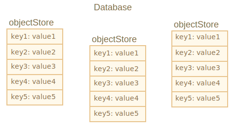
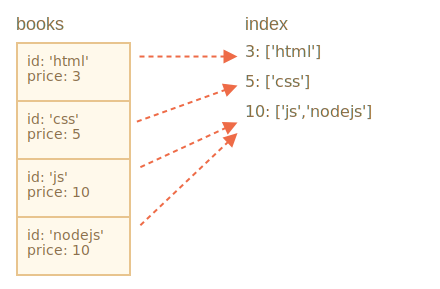

libs:

- 'https://cdn.jsdelivr.net/npm/idb@3.0.2/build/idb.min.js'

---

# IndexedDB

IndexedDB est une base de données intégrée au navigateur, beaucoup plus puissant que `localStorage`.

- Stocke presque tous types de valeurs par clés, plusieurs types de clés.
- Prend en charge les transactions pour la fiabilité.
- Prend en charge les requêtes de plage de clés, les index.
- Peut stocker des volumes de données beaucoup plus importants que `localstorage`.

Cette puissance est généralement excessive pour les applications traditionnelles client-serveur. IndexedDB est destiné aux applications hors ligne, pour être combinées avec ServiceWorker et d'autres technologies.

L'interface native à IndexedDB, décrite dans la spécification <https://www.w3.org/TR/IndexedDB>, est basée sur des événements.

<<<<<<< HEAD
Nous pouvons également utiliser `async/await` à l'aide d'un wrapper basé sur des promesses, comme <https://github.com/jakearchibald/idb> C'est assez pratique, mais le wrapper n'est pas parfait, il ne peut pas remplacer les événements pour tous les cas. Nous allons donc commencer par des événements, puis, après avoir compris IndexedDB, nous utiliserons le wrapper.
=======
We can also use `async/await` with the help of a promise-based wrapper, like <https://github.com/jakearchibald/idb>. That's pretty convenient, but the wrapper is not perfect, it can't replace events for all cases. So we'll start with events, and then, after we gain an understanding of IndexedDB, we'll use the wrapper.
>>>>>>> 1dce5b72b16288dad31b7b3febed4f38b7a5cd8a

```smart header="Où sont les données?"
Techniquement, les données sont généralement stockées dans le répertoire d'origine du visiteur, ainsi que les paramètres du navigateur, les extensions, etc.

Différents navigateurs et utilisateurs de niveau OS ont chacun leur propre stockage indépendant.
```

## Ouvrir une base de données

Pour commencer à travailler avec IndexedDB, nous devons d'abord "ouvrir" (connecter à) une base de données.

La syntaxe:

```js
let openRequest = indexedDB.open(name, version);
```

- `name` - une chaîne, le nom de la base de données.
- `version` - une version a nombre entier positif, par défaut `1` (expliqué ci-dessous).

Nous pouvons avoir de nombreuses bases de données avec des noms différents, mais tous existent dans l'origine actuelle (domaine/protocole/port). Différents sites Web ne peuvent pas accéder aux bases de données de l'autre.

L'appel renvoie l'objet `openRequest`, nous devons écouter les événements suivants:

- `success`: la base de données est prête, il y a "l'objet de base de données" dans `openRequest.result`, nous devons l'utiliser pour d'autres appels.
- `error`: l'ouverture a échoué.
- `upgradeneeded`: la base de données est prête, mais sa version est obsolète (voir ci-dessous).

**IndexedDB a un mécanisme intégré de "versionnage de schéma", absent dans les bases de données côté serveur.**

Contrairement aux bases de données côté serveur, IndexedDB est côté client, les données sont stockées dans le navigateur, donc nous, développeurs, n'ayons pas accès à temps plein. Ainsi, lorsque nous avons publié une nouvelle version de notre application et que l'utilisateur visite notre page Web, nous devrons peut-être mettre à jour la base de données.

Si la version de la base de données locale est inférieure à celle spécifiée dans `open`, un événement spécial `upgradeneeded` est déclenché, et nous pouvons comparer les versions et mettre à niveau les structures de données selon les besoins.

L'événement `upgradeneeded` se déclenche également lorsque la base de données n'existe pas encore (techniquement, sa version est `0`), nous pouvons donc effectuer l'initialisation.

Disons que nous avons publié la première version de notre application.

Ensuite, nous pouvons ouvrir la base de données avec la version `1` et effectuer l'initialisation dans un gestionnaire de `upgradeneeded` comme ceci:

```js
let openRequest = indexedDB.open("store", *!*1*/!*);

openRequest.onupgradeneeded = function() {
  // déclenche si le client n'avait pas de base de données
  // ...effectuer l'initialisation...
};

openRequest.onerror = function() {
  console.error("Error", openRequest.error);
};

openRequest.onsuccess = function() {
  let db = openRequest.result;
  // continuez à travailler avec la base de données à l'aide de l'objet db
};
```

Ensuite, plus tard, nous publions la 2ème version.

Nous pouvons l'ouvrir avec la version `2` et effectuer la mise à niveau comme ceci:

```js
let openRequest = indexedDB.open("store", *!*2*/!*);

openRequest.onupgradeneeded = function(event) {
  // la version de la base de données existante est inférieure à 2 (ou elle n'existe pas)
  let db = openRequest.result;
  switch(event.oldVersion) { // version db existante
    case 0:
      // la version 0 signifie que le client n'avait pas de base de données
      // effectuer l'initialisation
    case 1:
      // le client avait la version 1
      // mettre à jour
  }
};
```

Veuillez noter : comme notre version actuelle est `2`, le gestionnaire `onupgradneeded` a une branche de code pour la version `0`, adaptée aux utilisateurs qui accéderont pour la première fois et n'ont pas de base de données, ainsi que pour la version `1`, pour les mises à niveau.

Et puis, seulement si le gestionnaire `onupgradeededed` se termine sans erreurs, `openRequest.onsuccess` se déclanche et la base de données est considérée comme ouverte avec succès.

Pour supprimer une base de données:

```js
let deleteRequest = indexedDB.deleteDatabase(name);
// deleteRequest.onsuccess/onerror suit le résultat
```

```warn header="Nous ne pouvons pas ouvrir une base de données en utilisant une ancienne version de open"
Si la base de données de l'utilisateur actuel a une version plus élevée que dans l'appel `open`, par exemple la version de la DB existante est `3 ', et nous essayons `open(...2)`, c'est une erreur, `openRequest.onerror` se déclenche.

C'est rare, mais une telle chose peut se produire lorsqu'un visiteur charge le code JavaScript obsolète, par exemple à partir d'un cache proxy. Le code est donc vieux, mais sa base de données est nouvelle.

Pour protéger des erreurs, nous devons vérifier `db.version` et suggérer un rechargement de page. Utilisez les en-têtes de mise en cache HTTP appropriés pour éviter de charger l'ancien code, afin que vous n'ayez jamais de tels problèmes.
```

### Problème de mise à jour parallèle

Comme nous parlons de versionnage, abordons un petit problème connexe.

Disons:

1. Un visiteur a ouvert notre site dans un onglet de navigateur, avec la version de base de données `1`.
2. Ensuite, nous avons déployé une mise à jour, donc notre code est plus récent.
3. Et puis le même visiteur ouvre notre site dans un autre onglet.

Il y a donc un onglet avec une connexion ouverte à la version `1` de la base de données, tandis que le second tente de le mettre à jour vers la version `2` dans son gestionnaire `upgradeneeded`.

Le problème est qu'une base de données est partagée entre deux onglets, car c'est le même site, même origine. Et il ne peut pas s'agir à la fois des versions '1' et '2'. Pour effectuer la mise à jour vers la version `2`, toutes les connexions à la version 1 doivent être fermées, y compris celle du premier onglet.

Afin d'organiser cela, l'événement `versionchange` se déclenche sur l'objet de base de données "obsolète". Nous devrions écouter pour cela et fermer l'ancienne connexion à la base de données (et probablement suggérer un rechargement de page, pour charger le code mis à jour).

Si nous n'écoutons pas l'événement `versionchange` et ne fermons pas l'ancienne connexion, la deuxième, nouvelle connexion, ne sera pas établie. L'objet `openRequest` émettra l'événement `blocked` au lieu de `success`. Donc le deuxième onglet ne fonctionnera pas.

Voici le code pour gérer correctement la mise à jour parallèle. Il installe le gestionnaire `onversionchange`, qui se déclenche si la connexion actuelle à la base de données devient obsolète (la version de la base de données est mise à jour ailleurs) et ferme la connexion.

```js
let openRequest = indexedDB.open("store", 2);

openRequest.onupgradeneeded = ...;
openRequest.onerror = ...;

openRequest.onsuccess = function() {
  let db = openRequest.result;

  *!*
  db.onversionchange = function() {
    db.close();
    alert("Database is outdated, please reload the page.")
  };
  */!*

  // ...la base de données est prête, utilisez-la...
};

*!*
openRequest.onblocked = function() {
  // cet événement ne devrait pas se déclencher si nous gérons correctement onversionchange

  // cela signifie qu'il existe une autre connexion ouverte à la même base de données
  // et il n'a pas été fermé après le déclenchement de db.onversionchange
};
*/!*
```

...Autrement dit, ici on fait deux choses :

1. L'écouteur `db.onversionchange` nous informe d'une tentative de mise à jour parallèle, si la version actuelle de la base de données devient obsolète.
2. L'écouteur `openRequest.onblocked` nous informe de la situation inverse : il y a une connexion à une version obsolète ailleurs, et elle ne se ferme pas, donc la nouvelle connexion ne peut pas être établie.

Nous pouvons gérer les choses plus gracieusement dans `db.onversionchange`, inviter le visiteur à enregistrer les données avant la fermeture de la connexion, etc.

Ou, une approche alternative serait de ne pas fermer la base de données dans `db.onversionchange`, mais plutôt d'utiliser le gestionnaire `onblocked` (dans le nouvel onglet) pour alerter le visiteur, lui dire que la nouvelle version ne peut pas être chargée avant ils ferment d'autres onglets.

Ces collisions de mises à jour se produisent rarement, mais nous devrions au moins avoir une certaine gestion pour elles, au moins un gestionnaire `onblocked`, pour empêcher notre script de mourir silencieusement.

## Magasin d'objets

Pour stocker quelque chose dans IndexedDB, nous avons besoin d'un *magasin d'objets*.

Un magasin d'objets est un concept de base d'IndexedDB. Les équivalents dans d'autres bases de données sont appelés "tables" ou "collections". C'est là que les données sont stockées. Une base de données peut avoir plusieurs magasins : un pour les utilisateurs, un autre pour les biens, etc.

Bien qu'elles soient appelées "magasin d'objets", les primitives peuvent également être stockées.

**Nous pouvons stocker presque n'importe quelle valeur, y compris des objets complexes.**

IndexedDB utilise [l'algorithme standard de sérialisation](https://www.w3.org/TR/html53/infrastructure.html#section-structuredserializeforstorage) pour cloner et stocker un objet. C'est comme `JSON.stringify`, mais plus puissant, capable de stocker beaucoup plus de types de données.

Un exemple d'objet qui ne peut pas être stocké : un objet avec des références circulaires. De tels objets ne sont pas sérialisables. `JSON.stringify` échoue également pour ces objets.

**Il doit y avoir une `clé` unique pour chaque valeur du magasin.**

Une clé doit être de l'un de ces types : nombre, date, chaîne, binaire ou tableau. C'est un identifiant unique, nous pouvons donc rechercher/supprimer/mettre à jour des valeurs par clé.



Comme nous le verrons très bientôt, nous pouvons fournir une clé lorsque nous ajoutons une valeur au magasin, similaire à `localStorage`. Mais lorsque nous stockons des objets, IndexedDB permet de configurer une propriété d'objet comme clé, ce qui est beaucoup plus pratique. Ou nous pouvons générer automatiquement des clés.

Mais nous devons d'abord créer un magasin d'objets.

La syntaxe pour créer un magasin d'objets :

```js
db.createObjectStore(name, keyOptions);
```

Veuillez noter que l'opération est synchrone, `await` n'est nécessaire.

- `name` est le nom du magasin, par ex. `"books"` pour les livres,
- `keyOptions` est un objet facultatif avec l'une des deux propriétés :
  - `keyPath` -- un chemin vers une propriété d'objet qu'IndexedDB utilisera comme clé, par ex. `id`.
  - `autoIncrement` -- si `true`, alors la clé d'un objet nouvellement stocké est générée automatiquement, sous la forme d'un nombre toujours incrémenté.

Si nous ne fournissons pas `keyOptions`, nous devrons fournir une clé explicitement plus tard, lors du stockage d'un objet.

Par exemple, ce magasin d'objets utilise la propriété `id` comme clé :

```js
db.createObjectStore('books', {keyPath: 'id'});
```

**Un magasin d'objets ne peut être créé/modifié que lors de la mise à jour de la version de la base de données, dans le gestionnaire `upgradeneeded`.**

C'est une limitation technique. En dehors du gestionnaire, nous pourrons ajouter/supprimer/mettre à jour les données, mais les magasins d'objets ne peuvent être créés/supprimés/modifiés que lors d'une mise à jour de version.

Pour effectuer une mise à niveau de version de base de données, il existe deux approches principales :

1. Nous pouvons implémenter des fonctions de mise à niveau par version : de 1 à 2, de 2 à 3, de 3 à 4, etc. Ensuite, dans `upgradeneeded`, nous pouvons comparer les versions (par exemple, l'ancienne 2, maintenant la 4) et exécuter des mises à niveau par version étape par étape, pour chaque version intermédiaire (2 à 3, puis 3 à 4).
2. Ou nous pouvons simplement examiner la base de données : obtenez une liste des magasins d'objets existants sous le nom `db.objectStoreNames`. Cet objet est une [DOMStringList](https://html.spec.whatwg.org/multipage/common-dom-interfaces.html#domstringlist) qui fournit la méthode `contains(name)` pour vérifier l'existence. Et puis nous pouvons faire des mises à jour en fonction de ce qui existe et de ce qui n'existe pas.

Pour les petites bases de données, la deuxième variante peut être plus simple.

Voici la démo de la deuxième approche :

```js
let openRequest = indexedDB.open("db", 2);

// créer/mettre à jour la base de données sans vérification de version
openRequest.onupgradeneeded = function() {
  let db = openRequest.result;
  if (!db.objectStoreNames.contains('books')) {
    // s'il n'y a pas de magasin "books"
    db.createObjectStore('books', {keyPath: 'id'}); // créez-le
  }
};
```

Pour supprimer un magasin d'objets :

```js
db.deleteObjectStore('books');
```

## Transactions

Le terme "transaction" est générique, utilisé dans de nombreux types de bases de données.

Une transaction est un groupe d'opérations qui doivent toutes réussir ou toutes échouer.

Par exemple, lorsqu'une personne achète quelque chose, nous devons :

1. Soustrayez l'argent de leur compte.
2. Ajoutez l'objet à son inventaire.

Ce serait plutôt mauvais si nous terminions la 1ère opération, puis quelque chose ne va pas, par ex. les lumières s'éteignent, et nous ne parvenons pas à faire le 2ème. Les deux doivent soit réussir (achat terminé, bon !) soit échouer (au moins la personne a gardé son argent, elle peut donc réessayer).

Les transactions peuvent le garantir.

**Toutes les opérations de données doivent être effectuées dans une transaction dans IndexedDB.**

Pour démarrer une transaction :

```js
db.transaction(store, type);
```

- `store` est un nom de magasin auquel la transaction va accéder, par ex. `"books"`. Peut être un tableau de noms de magasins si nous allons accéder à plusieurs magasins.
- `type` - un type de transaction, l'un des suivants :
  - `readonly` -- peut uniquement lire, la valeur par défaut.
  - `readwrite` -- ne peut que lire et écrire les données, mais pas créer/supprimer/modifier les magasins d'objets.

Il y a aussi le type de transaction `versionchange` : ces transactions peuvent tout faire, mais nous ne pouvons pas les créer manuellement. IndexedDB crée automatiquement une transaction `versionchange` lors de l'ouverture de la base de données, pour le gestionnaire `upgradeneeded`. C'est pourquoi c'est un endroit unique où nous pouvons mettre à jour la structure de la base de données, créer/supprimer des magasins d'objets.

```smart header="Pourquoi existe-t-il différents types de transactions ?"
La performance est la raison pour laquelle les transactions doivent être étiquetées `readonly` et `readwrite`.

De nombreuses transactions en lecture seule peuvent accéder simultanément au même magasin, mais les transactions en lecture écriture ne le peuvent pas. Une transaction `readwrite` "verrouille" le magasin pour l'écriture. La prochaine transaction doit attendre que la précédente se termine avant d'accéder au même magasin.
```

Une fois la transaction créée, nous pouvons ajouter un article au magasin, comme ceci :

```js
let transaction = db.transaction("books", "readwrite"); // (1)

// obtenir un magasin d'objets pour opérer dessus
*!*
let books = transaction.objectStore("books"); // (2)
*/!*

let book = {
  id: 'js',
  price: 10,
  created: new Date()
};

*!*
let request = books.add(book); // (3)
*/!*

request.onsuccess = function() { // (4)
  console.log("Book added to the store", request.result);
};

request.onerror = function() {
  console.log("Error", request.error);
};
```

Il y avait essentiellement quatre étapes :

1. Créez une transaction, en mentionnant tous les magasins auxquels elle va accéder, à `(1)`.
2. Obtenez l'objet de magasin en utilisant `transaction.objectStore(name)`, à `(2)`.
3. Effectuez la demande au magasin d'objets `books.add(book)`, à `(3)`.
4. ...Gérer le succès/l'erreur de la demande `(4)`, puis nous pouvons faire d'autres demandes si nécessaire, etc.

Les magasins d'objets prennent en charge deux méthodes pour stocker une valeur :

- **put(value, [key])**
  Ajoutez `value` au magasin. `key` n'est fournie que si le magasin d'objets n'a pas l'option `keyPath` ou `autoIncrement`. S'il existe déjà une valeur avec la même clé, elle sera remplacée.

- **add(value, [key])**
  Identique à `put`, mais s'il existe déjà une valeur avec la même clé, la requête échoue et une erreur portant le nom `"ConstraintError"` est générée.

Semblable à l'ouverture d'une base de données, nous pouvons envoyer une requête : `books.add(book)`, puis attendre les événements `success/error`.

- Le `request.result` pour `add` est la clé du nouvel objet.
- L'erreur est dans `request.error` (le cas échéant).

## Validation automatique des transactions

Dans l'exemple ci-dessus, nous avons démarré la transaction et effectué une requête `add`. Mais comme nous l'avons indiqué précédemment, une transaction peut avoir plusieurs requêtes associées, qui doivent toutes réussir ou toutes échouer. Comment marquons-nous la transaction comme terminée, sans plus de demandes à venir ?

La réponse courte est : nous ne le faisons pas.

Dans la prochaine version 3.0 de la spécification, il y aura probablement un moyen manuel de terminer la transaction, mais pour le moment dans la version 2.0, il n'y en a pas.

**Lorsque toutes les requêtes de transaction sont terminées et que la [file d'attente de microtâches](info:microtask-queue) est vide, elle est validée automatiquement.**

Habituellement, nous pouvons supposer qu'une transaction est validée lorsque toutes ses requêtes sont terminées et que le code actuel se termine.

Ainsi, dans l'exemple ci-dessus, aucun appel spécial n'est nécessaire pour terminer la transaction.

Le principe de validation automatique des transactions a un effet secondaire important. Nous ne pouvons pas insérer une opération asynchrone comme `fetch`, `setTimeout` au milieu d'une transaction. IndexedDB ne maintiendra pas la transaction en attente jusqu'à ce que celles-ci soient terminées.

Dans le code ci-dessous, `request2` à la ligne `(*)` échoue, car la transaction est déjà validée et ne peut y faire aucune requête :

```js
let request1 = books.add(book);

request1.onsuccess = function() {
  fetch('/').then(response => {
*!*
    let request2 = books.add(anotherBook); // (*)
*/!*
    request2.onerror = function() {
      console.log(request2.error.name); // TransactionInactiveError
    };
  });
};
```

C'est parce que `fetch` est une opération asynchrone, une macrotâche. Les transactions sont fermées avant que le navigateur ne commence à effectuer des macrotâches.

Les auteurs de la spécification IndexedDB pensent que les transactions doivent être de courte durée. Principalement pour des raisons de performances.

Notamment, les transactions `readwrite` "verrouillent" les magasins pour l'écriture. Donc, si une partie de l'application a lancé `readwrite` sur le magasin d'objets `books`, alors une autre partie qui veut faire de même doit attendre : la nouvelle transaction "se bloque" jusqu'à ce que la première soit terminée. Cela peut entraîner des retards étranges si les transactions prennent beaucoup de temps.

Alors que faire?

Dans l'exemple ci-dessus, nous pourrions créer une nouvelle `db.transaction` juste avant la nouvelle requête `(*)`.

Mais ce sera encore mieux si nous souhaitons conserver les opérations ensemble, en une seule transaction, pour séparer les transactions IndexedDB et les "autres" éléments asynchrones.

Tout d'abord, faites `fetch`, préparez les données si nécessaire, puis créez une transaction et effectuez toutes les requêtes de base de données, cela fonctionnera alors.

Pour détecter le moment de l'achèvement réussi, nous pouvons écouter l'événement `transaction.oncomplete` :

```js
let transaction = db.transaction("books", "readwrite");

// ...effectuer des opérations...

transaction.oncomplete = function() {
  console.log("Transaction is complete");
};
```

Seul `complete` garantit que la transaction est enregistrée dans son ensemble. Les requêtes individuelles peuvent réussir, mais l'opération d'écriture finale peut mal tourner (par exemple, une erreur d'I/O ou autre).

Pour abandonner manuellement la transaction, appelez :

```js
transaction.abort();
```

Cela annule toutes les modifications apportées par les requêtes qu'il contient et déclenche l'événement `transaction.onabort`.

## La gestion des erreurs

Les demandes d'écriture peuvent échouer.

C'est normal, non seulement en raison d'éventuelles erreurs de notre part, mais aussi pour des raisons non liées à la transaction elle-même. Par exemple, le quota de stockage peut être dépassé. Nous devons donc être prêts à gérer un tel cas.

**Une requête ayant échoué annule automatiquement la transaction, annulant toutes ses modifications.**

Dans certaines situations, nous pouvons vouloir gérer l'échec (par exemple, essayer une autre requête), sans annuler les modifications existantes, et continuer la transaction. C'est possible. Le gestionnaire `request.onerror` est capable d'empêcher l'abandon de la transaction en appelant `event.preventDefault()`.

Dans l'exemple ci-dessous, un nouveau livre est ajouté avec la même clé (`id`) que celui existant. La méthode `store.add` génère une `"ConstraintError"` dans ce cas. Nous le traitons sans annuler la transaction :

```js
let transaction = db.transaction("books", "readwrite");

let book = { id: 'js', price: 10 };

let request = transaction.objectStore("books").add(book);

request.onerror = function(event) {
  // ConstraintError se produit lorsqu'un objet avec le même identifiant existe déjà
  if (request.error.name == "ConstraintError") {
    console.log("Book with such id already exists"); // gérer l'erreur
    event.preventDefault(); // ne pas interrompre la transaction
    // utiliser une autre clé pour le livre ?
  } else {
    // erreur inattendue, impossible à gérer
    // la transaction sera annulée
  }
};

transaction.onabort = function() {
  console.log("Error", transaction.error);
};
```

### Délégation d'événements

Avons-nous besoin de onerror/onsuccess pour chaque requête ? Pas à chaque fois. Nous pouvons utiliser la délégation d'événements à la place.

**Les événements d,IndexedDB se propagent : `request` -> `transaction` -> `database`.**

Tous les événements sont des événements DOM, avec capture et propagation, mais généralement, seule la phase de propagation est utilisée.

Nous pouvons donc intercepter toutes les erreurs à l'aide du gestionnaire `db.onerror`, à des fins de rapport ou à d'autres fins :

```js
db.onerror = function(event) {
  let request = event.target; // la requête à l'origine de l'erreur

  console.log("Error", request.error);
};
```

...Mais que se passe-t-il si une erreur est entièrement gérée ? Nous ne voulons pas le signaler dans ce cas.

Nous pouvons arrêter la propagation et donc `db.onerror` en utilisant `event.stopPropagation()` dans `request.onerror`.

```js
request.onerror = function(event) {
  if (request.error.name == "ConstraintError") {
    console.log("Book with such id already exists"); // gérer l'erreur
    event.preventDefault(); // ne pas interrompre la transaction
    event.stopPropagation(); // ne propagez pas l'erreur, "mâchez-la"
  } else {
    // ne fais rien
    // la transaction sera abandonnée
    // nous pouvons nous occuper de l'erreur dans transaction.onabort
  }
};
```

## Recherche

Il existe deux principaux types de recherche dans un magasin d'objets :

1. Par une valeur de clé ou une plage de clés. Dans notre stockage "books", ce serait une valeur ou une plage de valeurs de `book.id`.
2. Par un autre champ d'objet, par ex. `book.price`. Cela nécessitait une structure de données supplémentaire, nommée "index".

### Par clé

Traitons d'abord le premier type de recherche : par clé.

Les méthodes de recherche prennent en charge à la fois les valeurs de clé exactes et les "plages de valeurs" -- Les objets [IDBKeyRange](https://www.w3.org/TR/IndexedDB/#keyrange) spécifient une "plage de clés" acceptable.

Les objets `IDBKeyRange` sont créés à l'aide des appels suivants :

- `IDBKeyRange.lowerBound(lower, [open])` signifie : `≥lower` (ou `>lower` si `open` est true)
- `IDBKeyRange.upperBound(upper, [open])` signifie : `≤upper` (ou `<upper` si `open` est true)
- `IDBKeyRange.bound(lower, upper, [lowerOpen], [upperOpen])` signifie : entre `lower` et `upper`. Si les drapeaux open sont true, la clé correspondante n'est pas incluse dans la plage.
- `IDBKeyRange.only(key)` -- une plage composée d'une seule `key`, rarement utilisée.

Nous verrons très prochainement des exemples concrets d'utilisation.

Pour effectuer la recherche proprement dite, il existe les méthodes suivantes. Ils acceptent un argument `query` qui peut être une clé exacte ou une plage de clés :

- `store.get(query)` -- recherche la première valeur par une clé ou une plage.
- `store.getAll([query], [count])` -- recherche toutes les valeurs, limite par `count` si donné.
- `store.getKey(query)` -- recherche la première clé qui satisfait la requête, généralement une plage.
- `store.getAllKeys([query], [count])` -- recherche toutes les clés qui satisfont la requête, généralement une plage, jusqu'à `count` si donné.
- `store.count([query])` -- obtient le nombre total de clés qui satisfont la requête, généralement une plage.

Par exemple, nous avons beaucoup de livres dans notre magasin. N'oubliez pas que le champ `id` est la clé, donc toutes ces méthodes peuvent rechercher par `id`.

Exemples de requête :

```js
// obtenir un livre
books.get('js');

// obtenir des livres avec 'css' <= id <= 'html'
books.getAll(IDBKeyRange.bound('css', 'html'));

// obtenir des livres avec id < 'html'
books.getAll(IDBKeyRange.upperBound('html', true));

// obtenir tous les livres
books.getAll();

// obtenir toutes les clés, où id > 'js'
books.getAllKeys(IDBKeyRange.lowerBound('js', true));
```

```smart header="Le magasin d'objets est toujours trié"
Un magasin d'objets trie les valeurs par clé en interne.

Ainsi, les requêtes qui renvoient de nombreuses valeurs les renvoient toujours triées par ordre de clé.
```

### Par un champ utilisant un index

Pour rechercher par d'autres champs d'objets, nous devons créer une structure de données supplémentaire nommée "index".

Un index est un "module complémentaire" au magasin qui suit un champ d'objet donné. Pour chaque valeur de ce champ, il stocke une liste de clés pour les objets qui ont cette valeur. Il y aura une image plus détaillée ci-dessous.

La syntaxe :

```js
objectStore.createIndex(name, keyPath, [options]);
```

- **`name`** -- nom de l'index,
- **`keyPath`** -- chemin vers le champ de l'objet que l'index doit suivre (nous allons chercher par ce champ),
- **`option`** -- un objet optionnel avec les propriétés :
  - **`unique`** -- si true, alors il ne peut y avoir qu'un seul objet dans le magasin avec la valeur donnée au `keyPath`. L'index appliquera cela en générant une erreur si nous essayons d'ajouter un doublon.
  - **`multiEntry`** -- utilisé uniquement si la valeur de `keyPath` est un tableau. Dans ce cas, par défaut, l'index traitera le tableau entier comme clé. Mais si `multiEntry` est true, alors l'index conservera une liste d'objets de magasin pour chaque valeur de ce tableau.Ainsi, les membres du tableau deviennent des clés d'index.

Dans notre exemple, nous stockons des livres dont la clé est `id`.

Disons que nous voulons effectuer une recherche par `price`.

Tout d'abord, nous devons créer un index. Cela doit être fait dans `upgradeneeded`, tout comme un magasin d'objets :

```js
openRequest.onupgradeneeded = function() {
  // il faut créer l'index ici, dans la transaction versionchange
  let books = db.createObjectStore('books', {keyPath: 'id'});
*!*
  let index = books.createIndex('price_idx', 'price');
*/!*
};
```

- L'index suivra le champ `price`.
- Le prix n'est pas unique, il peut y avoir plusieurs livres avec le même prix, nous ne définissons donc pas l'option `unique`.
- Le prix n'est pas un tableau, donc le drapeau `multiEntry` n'est pas applicable.

Imaginez que notre `inventory` compte 4 livres. Voici l'image qui montre exactement ce qu'est l'`index` :



Comme indiqué, l'index pour chaque valeur de `price` (deuxième argument) conserve la liste des clés qui ont ce prix.

L'index se tient automatiquement à jour, nous n'avons pas à nous en soucier.

Désormais, lorsque nous voulons rechercher un prix donné, nous appliquons simplement les mêmes méthodes de recherche à l'index :

```js
let transaction = db.transaction("books"); // readonly
let books = transaction.objectStore("books");
let priceIndex = books.index("price_idx");

*!*
let request = priceIndex.getAll(10);
*/!*

request.onsuccess = function() {
  if (request.result !== undefined) {
    console.log("Books", request.result); // tableau de livres avec price=10
  } else {
    console.log("No such books");
  }
};
```

Nous pouvons également utiliser `IDBKeyRange` pour créer des gammes et rechercher des livres bon marché/chers :

```js
// trouver des livres où price <= 5
let request = priceIndex.getAll(IDBKeyRange.upperBound(5));
```

Les index sont triés en interne par le champ d'objet suivi, `price` dans notre cas. Ainsi, lorsque nous effectuons la recherche, les résultats sont également triés par `price`.

## Supprimer du magasin

La méthode `delete` recherche les valeurs à supprimer par une requête, le format d'appel est similaire à `getAll` :

- **`delete(query)`** -- supprime les valeurs correspondantes par requête.

Par exemple:

```js
// supprimer le livre où id='js'
books.delete('js');
```

Si nous souhaitons supprimer des livres en fonction d'un prix ou d'un autre champ d'objet, nous devons d'abord rechercher la clé dans l'index, puis appeler `delete` :

```js
// trouver la clé où price = 5
let request = priceIndex.getKey(5);

request.onsuccess = function() {
  let id = request.result;
  let deleteRequest = books.delete(id);
};
```

Pour tout supprimer :

```js
books.clear(); // effacer le stockage.
```

## Curseurs

Des méthodes comme `getAll/getAllKeys` retournent un tableau de clés/valeurs.

Mais un magasin d'objets peut être énorme, plus grand que la mémoire disponible. Alors `getAll` échouera à obtenir tous les enregistrements sous forme de tableau.

Que faire?

Les curseurs permettent de contourner cela.

**Un *curseur* est un objet spécial qui traverse le magasin d'objets, étant donné une requête, et renvoie une clé/valeur à la fois, économisant ainsi de la mémoire.**

Comme un magasin d'objets est trié en interne par clé, un curseur parcourt le magasin dans l'ordre des clés (ascendant par défaut).

La syntaxe :

```js
// comme getAll, mais avec un curseur :
let request = store.openCursor(query, [direction]);

// pour obtenir des clés, pas des valeurs (comme getAllKeys): store.openKeyCursor
```

- **`query`** est une clé ou une plage de clés, comme pour `getAll`.
- **`direction`** est un argument facultatif, dans quel ordre utiliser :
  - `"next"` -- la valeur par défaut, le curseur remonte à partir de l'enregistrement avec la clé la plus basse.
  - `"prev"` -- l'ordre inverse : vers le bas à partir de l'enregistrement avec la plus grande clé.
  - `"nextunique"`, `"prevunique"` -- comme ci-dessus, mais ignore les enregistrements avec la même clé (uniquement pour les curseurs sur les index, par exemple pour plusieurs livres avec price=5, seul le premier sera renvoyé).

**La principale différence du curseur est que `request.onsuccess` se déclenche plusieurs fois : une fois pour chaque résultat.**

Voici un exemple d'utilisation d'un curseur :

```js
let transaction = db.transaction("books");
let books = transaction.objectStore("books");

let request = books.openCursor();

// appelé pour chaque livre trouvé par le curseur
request.onsuccess = function() {
  let cursor = request.result;
  if (cursor) {
    let key = cursor.key; // clé de livre (champ id)
    let value = cursor.value; // objet livre
    console.log(key, value);
    cursor.continue();
  } else {
    console.log("No more books");
  }
};
```

Les principales méthodes de curseur sont :

- `advance(count)` -- avance le curseur `count` fois, en sautant les valeurs.
- `continue([key])` -- avance le curseur à la valeur suivante dans la correspondance de plage (ou immédiatement après `key` si elle est donnée).

Qu'il y ait plus de valeurs correspondant au curseur ou non - `onsuccess` est appelé, puis dans `result` nous pouvons faire pointer le curseur vers l'enregistrement suivant, ou `undefined`.

Dans l'exemple ci-dessus, le curseur a été créé pour le magasin d'objets.

Mais nous pouvons aussi placer un curseur sur un index. Rappelons que les index permettent de rechercher par champ objet. Les curseurs sur les index font exactement la même chose que sur les magasins d'objets - ils économisent de la mémoire en renvoyant une valeur à la fois.

Pour les curseurs sur les index, `cursor.key` est la clé d'index (par exemple, le prix), et nous devrions utiliser la propriété `cursor.primaryKey` pour la clé d'objet :

```js
let request = priceIdx.openCursor(IDBKeyRange.upperBound(5));

// appelé pour chaque enregistrement
request.onsuccess = function() {
  let cursor = request.result;
  if (cursor) {
    let primaryKey = cursor.primaryKey; // prochaine clé de magasin d'objets (champ id)
    let value = cursor.value; // prochain objet de magasin d'objets (objet livre)
    let key = cursor.key; // clé d'index suivante (price)
    console.log(key, value);
    cursor.continue();
  } else {
    console.log("No more books");
  }
};
```

## Promise wrapper

Ajouter `onsuccess/onerror` à chaque requête est une tâche assez lourde. Parfois, nous pouvons nous faciliter la vie en utilisant la délégation d'événements, par ex. définir des gestionnaires sur l'ensemble des transactions, mais `async/wait` est beaucoup plus pratique.

Utilisons un wrapper de promesses léger <https://github.com/jakearchibald/idb> plus loin dans ce chapitre. Il crée un objet `idb` global avec les méthodes IndexedDB en tant que [promesse](info:promisify).

Ensuite, au lieu de `onsuccess/onerror` nous pouvons écrire comme ceci :

```js
let db = await idb.openDB('store', 1, db => {
  if (db.oldVersion == 0) {
    // effectuer l'initialisation
    db.createObjectStore('books', {keyPath: 'id'});
  }
});

let transaction = db.transaction('books', 'readwrite');
let books = transaction.objectStore('books');

try {
  await books.add(...);
  await books.add(...);

  await transaction.complete;

  console.log('jsbook saved');
} catch(err) {
  console.log('error', err.message);
}
```

Nous avons donc tous les trucs sympas de "code asynchrone simple" et "try..catch".

### La gestion des erreurs

Si nous n'interceptons pas d'erreur, alors elle tombe à travers, jusqu'au `try..catch` extérieur le plus proche.

Une erreur non interceptée devient un événement "unhandled promise rejection" sur l'objet `window`.

Nous pouvons gérer de telles erreurs comme ceci :

```js
window.addEventListener('unhandledrejection', event => {
  let request = event.target; // objet de requête natif IndexedDB
  let error = event.reason; //  objet d'erreur non géré, comme request.error
  ...report about the error...
});
```

### Le piège de "Inactive transaction"

Comme nous le savons déjà, une transaction s'auto-valide dès que le navigateur a terminé avec le code et les microtâches actuels. Donc, si nous plaçons une *macrotask* comme `fetch` au milieu d'une transaction, alors la transaction n'attendra pas qu'elle se termine. Il s'auto-valide simplement. Ainsi, la prochaine requête échouerait.

Pour un wrapper de promesse et `async/wait` la situation est la même.

Voici un exemple de `fetch` au milieu de la transaction :

```js
let transaction = db.transaction("inventory", "readwrite");
let inventory = transaction.objectStore("inventory");

await inventory.add({ id: 'js', price: 10, created: new Date() });

await fetch(...); // (*)

await inventory.add({ id: 'js', price: 10, created: new Date() }); // Erreur
```

Le prochain `inventory.add` après `fetch` `(*)` échoue avec une erreur "inactive transaction", car la transaction est déjà validée et fermée à ce moment-là.

La solution de contournement est la même que lorsque vous travaillez avec IndexedDB natif : faites une nouvelle transaction ou séparez simplement les éléments.

1. Préparez les données et récupérez tout ce qui est nécessaire en premier.
2. Enregistrez ensuite dans la base de données.

### Obtenir des objets natifs

En interne, le wrapper exécute une requête IndexedDB native, en y ajoutant `onerror/onsuccess`, et renvoie une promesse qui rejette/résout avec le résultat.

Cela fonctionne bien la plupart du temps. Les exemples sont sur la page lib <https://github.com/jakearchibald/idb>.

Dans quelques rares cas, lorsque nous avons besoin de l'objet `request` d'origine, nous pouvons y accéder en tant que propriété `promise.request` de la promesse :

```js
let promise = books.add(book); // obtenir une promesse (n'attendez pas son résultat)

let request = promise.request; // objet de requête natif
let transaction = request.transaction; // objet de transaction natif

// ...faites du vaudou IndexedDB natif...

let result = await promise; // s'il faut encore
```

## Résumé

IndexedDB peut être considéré comme un "localStorage sur des stéroïdes". Il s'agit d'une simple base de données clé-valeur, suffisamment puissante pour les applications hors ligne, mais simple à utiliser.

Le meilleur manuel est la spécification, [l'actuelle](https://www.w3.org/TR/IndexedDB-2/) est 2.0, mais quelques des méthodes de [3.0](https://w3c.github.io/IndexedDB/) (ce n'est pas très différent) sont partiellement pris en charge.

L'utilisation de base peut être décrite en quelques phrases :

1. Obtenez un wrapper de promesses comme [idb](https://github.com/jakearchibald/idb).
2. Ouvrez une base de données : `idb.openDb(name, version, onupgradeneeded)`
   - Créez des stockages d'objets et des index dans le gestionnaire `onupgradeneeded` ou effectuez une mise à jour de version si nécessaire.
3. Pour les demandes :
   - Créer la transaction `db.transaction('books')` (readwrite si nécessaire).
   - Récupérez le magasin d'objets `transaction.objectStore('books')`.
4. Ensuite, pour effectuer une recherche par clé, appelez directement les méthodes du magasin d'objets.
   - Pour effectuer une recherche par champ d'objet, créez un index.
5. Si les données ne rentrent pas en mémoire, utilisez un curseur.

Voici une petite application de démonstration :

[codetabs src="books" current="index.html"]
