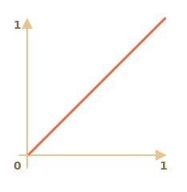
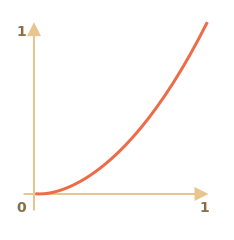
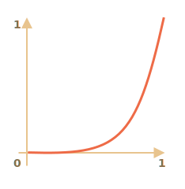
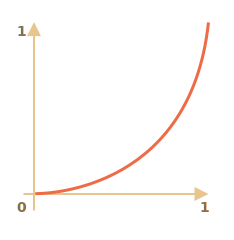
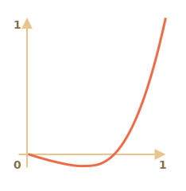
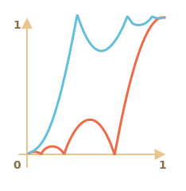
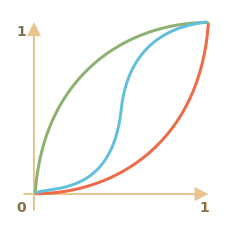

# Animations JavaScript

Les animations JavaScript peuvent gérer des choses que CSS ne peut pas gérer.

Par exemple, le déplacement le long d'un chemin complexe, avec une fonction de temporisation différente des courbes de Bézier, ou une animation sur un élément canvas.

## Utilisation de setInterval

Une animation peut être implémentée sous la forme d'une séquence d'images -- généralement de petites modifications des propriétés HTML/CSS.

Par exemple, en changeant `style.left` de `0px` à `100px`, on déplace l'élément. Et si nous l'augmentons dans `setInterval`, en changeant de `2px` avec un minuscule retard, comme 50 fois par seconde, alors cela semble fluide. C'est le même principe qu'au cinéma : 24 images par seconde suffisent pour que l'image soit fluide.

Le pseudo-code peut ressembler à ceci :

```js
let timer = setInterval(function() {
  if (animation complete) clearInterval(timer);
  else increase style.left by 2px
}, 20); // changement de 2px toutes les 20ms, environ 50 images par seconde
```

Exemple plus complet de l'animation :

```js
let start = Date.now(); // mémoriser l'heure de début

let timer = setInterval(function() {
  // combien de temps s'est écoulé depuis le début ?
  let timePassed = Date.now() - start;

  if (timePassed >= 2000) {
    clearInterval(timer); // terminer l'animation après 2 secondes
    return;
  }

  // dessiner l'animation à l'instant timePassed
  draw(timePassed);

}, 20);

// à mesure que timePassed passe de 0 à 2000
// left obtient des valeurs de 0px à 400px
function draw(timePassed) {
  train.style.left = timePassed / 5 + 'px';
}
```

Cliquez pour la démo :

[codetabs height=200 src="move"]

## Utilisation de requestAnimationFrame

Imaginons que nous ayons plusieurs animations fonctionnant simultanément.

Si nous les exécutons séparément, alors même si chacune d'entre elles possède `setInterval(..., 20)`, le navigateur devra repeindre bien plus souvent que toutes les `20ms`.

C'est parce qu'elles ont un temps de départ différent, donc "toutes les 20 ms" diffère entre les différentes animations. Les intervalles ne sont pas alignés. Nous aurons donc plusieurs animations indépendantes dans un intervalle de `20ms`.

En d'autres termes, ceci :

```js
setInterval(function() {
  animate1();
  animate2();
  animate3();
}, 20)
```

...Est plus léger que trois appels indépendants :

```js
setInterval(animate1, 20); // animations indépendantes
setInterval(animate2, 20); // à différents endroits du script
setInterval(animate3, 20);
```

Ces redessinages indépendants doivent être regroupés, afin de faciliter le redessinage pour le navigateur et donc de réduire la charge du processeur et d'obtenir un aspect plus fluide.

Il y a une autre chose à garder en tête. Parfois, le CPU est surchargé, ou il y a d'autres raisons de redessiner moins souvent (comme lorsque l'onglet du navigateur est caché), donc nous ne devrions vraiment pas le lancer tous les `20ms`.

Mais comment le savoir en JavaScript ? Il existe une spécification [Animation timing](https://www.w3.org/TR/animation-timing/) qui fournit la fonction `requestAnimationFrame`. Elle répond à toutes ces questions et même plus.

La syntaxe :
```js
let requestId = requestAnimationFrame(callback)
```

Cela programme la fonction `callback` pour qu'elle s'exécute au moment le plus proche où le navigateur veut faire une animation.

Si nous modifions des éléments dans `callback`, ils seront regroupés avec d'autres callbacks `requestAnimationFrame` et avec les animations CSS. Il y aura donc un seul recalcul de la géométrie et un seul repeint au lieu de plusieurs.

La valeur retournée `requestId` peut être utilisée pour annuler l'appel :
```js
// annuler l'exécution programmée du callback
cancelAnimationFrame(requestId);
```

Le `callback` reçoit un argument -- le temps écoulé depuis le début du chargement de la page en microsecondes. Ce temps peut aussi être obtenu en appelant [performance.now()](https://developer.mozilla.org/fr/docs/Web/API/Performance/now).

Habituellement, `callback` s'exécute très rapidement, à moins que le CPU soit surchargé ou que la batterie de l'ordinateur portable soit presque déchargée, ou qu'il y ait une autre raison.

Le code ci-dessous montre le temps entre les 10 premières exécutions de `requestAnimationFrame`. Habituellement, c'est 10-20ms :

```html run height=40 refresh
<script>
  let prev = performance.now();
  let times = 0;

  requestAnimationFrame(function measure(time) {
    document.body.insertAdjacentHTML("beforeEnd", Math.floor(time - prev) + " ");
    prev = time;

    if (times++ < 10) requestAnimationFrame(measure);
  })
</script>
```

## Animation structurée

Maintenant nous pouvons faire une fonction d'animation plus universelle basée sur `requestAnimationFrame` :

```js
function animate({timing, draw, duration}) {

  let start = performance.now();

  requestAnimationFrame(function animate(time) {
    // timeFraction passe de 0 à 1
    let timeFraction = (time - start) / duration;
    if (timeFraction > 1) timeFraction = 1;

    // calculer l'état courant de l'animation
    let progress = timing(timeFraction)

    draw(progress); // dessinez-le

    if (timeFraction < 1) {
      requestAnimationFrame(animate);
    }

  });
}
```

La fonction `animate` accepte 3 paramètres qui décrivent essentiellement l'animation :

`duration``
: Durée totale de l'animation. Par exemple, `1000`.

`timing(timeFraction)`
: Fonction de chronométrage, comme la propriété CSS `transition-timing-function` qui obtient la fraction de temps qui s'est écoulée (`0` au début, `1` à la fin) et renvoie la fin de l'animation (comme `y` sur la courbe de Bézier).

    Par exemple, une fonction linéaire signifie que l'animation se déroule uniformément avec la même vitesse :

    ```js
    function linear(timeFraction) {
      return timeFraction;
    }
    ```

    Son graph :
    

    C'est comme `transition-timing-function : linear`. Il existe d'autres variantes intéressantes présentées ci-dessous.

`draw(progress)`
: La fonction qui prend l'état final de l'animation et le dessine. La valeur `progress=0` indique l'état de début d'animation, et `progress=1` -- l'état de fin.

    Il s'agit de la fonction qui dessine réellement l'animation.

    Elle peut déplacer l'élément :
    ```js
    function draw(progress) {
      train.style.left = progress + 'px';
    }
    ```

    ...Ou faire n'importe quoi d'autre, nous pouvons animer toute chose, de n'importe quelle manière.


Animons l'élément `width` de `0` à `100%` en utilisant notre fonction.

Cliquez sur l'élément pour la démonstration :

[codetabs height=60 src="width"]

Le code pour cela :

```js
animate({
  duration: 1000,
  timing(timeFraction) {
    return timeFraction;
  },
  draw(progress) {
    elem.style.width = progress * 100 + '%';
  }
});
```

Contrairement à l'animation CSS, nous pouvons créer ici n'importe quelle fonction de temporisation et n'importe quelle fonction draw (de dessinnage). La fonction de timing n'est pas limitée par les courbes de Bézier. Et `draw` peut aller au-delà des propriétés, créer de nouveaux éléments pour une animation de feu d'artifice ou autre.

## Fonctions de temporisation

Nous avons vu la fonction de temporisation la plus simple, linéaire, ci-dessus.

Nous allons en voir d'autres. Nous allons essayer des animations de mouvements avec différentes fonctions de temporisation pour voir comment elles fonctionnent.

### Puissance de n

Si nous voulons accélérer l'animation, nous pouvons utiliser `progress` à la puissance `n`.

Par exemple, une courbe parabolique :

```js
function quad(timeFraction) {
  return Math.pow(timeFraction, 2)
}
```

Le graph :



Voir en action (cliquer pour activer) :

[iframe height=40 src="quad" link]

...Ou la courbe cubique ou encore un `n` plus grand. En augmentant la puissance, on accélère la vitesse.

Voici le graphique de `progress` à la puissance `5` :



En action :

[iframe height=40 src="quint" link]

### L'arc

Fonction :

```js
function circ(timeFraction) {
  return 1 - Math.sin(Math.acos(timeFraction));
}
```

Le graph:



[iframe height=40 src="circ" link]

### Back : tir à l'arc

Cette fonction effectue le "tir à l'arc" (bow shooting). On commence par "tirer la corde de l'arc", puis on "tire".

Contrairement aux fonctions précédentes, elle dépend d'un paramètre supplémentaire `x`, le "coefficient d'élasticité". La distance de "traction de la corde de l'arc" est définie par celui-ci.

Le code :

```js
function back(x, timeFraction) {
  return Math.pow(timeFraction, 2) * ((x + 1) * timeFraction - x)
}
```

**Le graph pour `x = 1.5`:**



Pour l'animation, nous l'utilisons avec une valeur spécifique de `x`. Exemple pour `x = 1.5` :

[iframe height=40 src="back" link]

### Bounce

Imaginez que nous lâchons une balle. Elle tombe, puis rebondit plusieurs fois et s'arrête.

La fonction `bounce` fait la même chose, mais dans l'ordre inverse : Le "rebond" commence immédiatement. Elle utilise quelques coefficients spéciaux pour cela :

```js
function bounce(timeFraction) {
  for (let a = 0, b = 1; 1; a += b, b /= 2) {
    if (timeFraction >= (7 - 4 * a) / 11) {
      return -Math.pow((11 - 6 * a - 11 * timeFraction) / 4, 2) + Math.pow(b, 2)
    }
  }
}
```

En action :

[iframe height=40 src="bounce" link]

### Animation élastique

Une fonction "élastique" de plus qui accepte un paramètre supplémentaire `x` pour la "portée initiale".

```js
function elastic(x, timeFraction) {
  return Math.pow(2, 10 * (timeFraction - 1)) * Math.cos(20 * Math.PI * x / 3 * timeFraction)
}
```

**Le graph pour `x=1.5`:**


En action pour `x=1.5` :

[iframe height=40 src="elastic" link]

## Reversal : ease*

Nous avons donc une collection de fonctions de temporisation. Leur application directe est appelée "easeIn".

Parfois, nous avons besoin de montrer l'animation dans l'ordre inverse. C'est possible avec la transformation "easeOut".

### easeOut

Dans le mode "easeOut", la fonction `timing` est placée dans un wrapper `timingEaseOut` :

```js
timingEaseOut(timeFraction) = 1 - timing(1 - timeFraction)
```

En d'autres termes, nous avons une fonction de "transformation" `makeEaseOut` qui prend une fonction de temporisation "régulière" et renvoie le wrapper qui l'entoure :

```js
// accepte une fonction de temporisation, renvoie la variante transformée
function makeEaseOut(timing) {
  return function(timeFraction) {
    return 1 - timing(1 - timeFraction);
  }
}
```

Par exemple, nous pouvons prendre la fonction `bounce` décrite ci-dessus et l'appliquer :

```js
let bounceEaseOut = makeEaseOut(bounce);
```

Ainsi, le rebond ne sera pas au début, mais à la fin de l'animation. C'est encore mieux :

[codetabs src="bounce-easeout"]

Ici, nous pouvons voir comment la transformation change le comportement de la fonction :



S'il y a un effet d'animation au début, comme le rebondissement -- il sera affiché à la fin.

Dans le graphique ci-dessus, le <span style="color:#EE6B47">regular bounce</span> a la couleur rouge, et le <span style="color:#62C0DC">easeOut bounce</span> est bleu.

- Regular bounce -- l'objet rebondit en bas, puis à la fin saute brusquement en haut.
- Après `easeOut` -- il saute d'abord vers le haut, puis rebondit là.

### easeInOut

Nous pouvons également montrer l'effet à la fois au début et à la fin de l'animation. La transformation est appelée "easeInOut".

Étant donné la fonction de temporisation, nous calculons l'état de l'animation comme suit :

```js
if (timeFraction <= 0.5) { // première moitié de l'animation
  return timing(2 * timeFraction) / 2;
} else { // deuxième moitié de l'animation
  return (2 - timing(2 * (1 - timeFraction))) / 2;
}
```

Le code du wrapper :

```js
function makeEaseInOut(timing) {
  return function(timeFraction) {
    if (timeFraction < .5)
      return timing(2 * timeFraction) / 2;
    else
      return (2 - timing(2 * (1 - timeFraction))) / 2;
  }
}

bounceEaseInOut = makeEaseInOut(bounce);
```

En action, `bounceEaseInOut` :

[codetabs src="bounce-easeinout"]

La transformation "easeInOut" joint deux graphiques en un seul : `easeIn` (régulier) pour la première moitié de l'animation et `easeOut` (inversé) -- pour la deuxième moitié.

L'effet est clairement visible si l'on compare les graphiques de `easeIn`, `easeOut` et `easeInOut` de la fonction de temporisation `circ` :



- <span style="color:#EE6B47">Red</span> est la variante régulière de `circ` (`easeIn`).
- <span style="color:#8DB173">Green</span> -- `easeOut`.
- <span style="color:#62C0DC">Blue</span> -- `easeInOut`.

Comme nous pouvons le voir, le graphique de la première moitié de l'animation est le `easeIn` atténué, et la seconde moitié est le `easeOut` atténué. Par conséquent, l'animation commence et se termine avec le même effet.

## Un " draw " plus intéressant

Au lieu de déplacer l'élément, nous pouvons faire autre chose. Il suffit d'écrire le bon `draw`.

Voici la saisie animée du texte "rebondissant" :

[codetabs src="text"]

## Résumé

Pour les animations que CSS ne peut pas bien gérer, ou celles qui nécessitent un contrôle précis, JavaScript peut aider. Les animations JavaScript doivent être implémentées via `requestAnimationFrame`. Cette méthode intégrée permet de configurer une fonction callback à exécuter lorsque le navigateur prépare un repeint. En général, c'est très bientôt, mais le moment exact dépend du navigateur.

Lorsqu'une page est en arrière-plan, il n'y a pas de repeint du tout, donc la fonction de rappel ne sera pas exécutée : l'animation sera suspendue et ne consommera pas de ressources. C'est très bien.

Voici la fonction d'aide `animate` pour configurer la plupart des animations :

```js
function animate({timing, draw, duration}) {

  let start = performance.now();

  requestAnimationFrame(function animate(time) {
    // timeFraction passe de 0 à 1
    let timeFraction = (time - start) / duration;
    if (timeFraction > 1) timeFraction = 1;

    // calculer l'état courant de l'animation
    let progress = timing(timeFraction);

    draw(progress); // dessinez-le

    if (timeFraction < 1) {
      requestAnimationFrame(animate);
    }

  });
}
```

Options :

- `duration` -- la durée totale de l'animation en ms.
- `timing` -- la fonction pour calculer la progression de l'animation. Donne une fraction de temps de 0 à 1, retourne la progression de l'animation, généralement de 0 à 1.
- `draw` -- la fonction pour dessiner l'animation.

Nous pourrions certainement l'améliorer, mais les animations JavaScript ne sont pas utilisées quotidiennement. Elles sont utilisées pour faire quelque chose d'intéressant et de non standard. Vous voudriez donc ajouter les fonctionnalitées dont vous avez besoin quand vous en avez besoin.

Les animations JavaScript peuvent utiliser n'importe quelle fonction de temporisation. Nous avons couvert beaucoup d'exemples et de transformations pour les rendre encore plus polyvalentes. Contrairement à CSS, nous ne sommes pas limités ici aux courbes de Bézier.

<<<<<<< HEAD
Il en va de même pour `draw` : nous pouvons animer n'importe quoi, pas seulement des propriétés CSS.
=======
The same is true about `draw`: we can animate anything, not just CSS properties.
>>>>>>> 1dce5b72b16288dad31b7b3febed4f38b7a5cd8a
