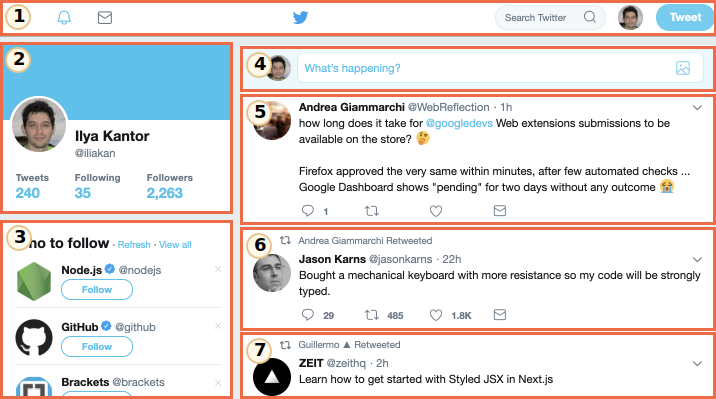

# Prenons un peu de recul

Cette section décrit un ensemble des standards actuels pour les "web components".

Encore aujourd'hui, ces standards sont toujours en développement. Quelques fonctionnalités sont bien supportées/intégrées dans les conventions HTML/DOM moderne, tandis que d'autres sont toujours au stade d'ébauches. Vous pouvez essayer les différents exemples dans n'importe quel navigateur, tout en gardant à l'esprit que Google Chrome est probablement le plus avancé en ce qui concerne l'intégration de ces fonctionnalités... Probablement car ce sont les développeurs de chez Google qui ont travaillé sur beaucoup de ces dites fonctionnalités.

## Rien de nouveau à l'horizon...

L'idée même de composant n'a rien de nouveau : ils sont déjà utilisés, entre autre, dans beaucoups de frameworks.

Avant de parler des détails techniques, prenons un instant pour contempler l'une des plus grande réussite de l'humanité :

Voici la Station Spatiale Internationale (ISS pour les intimes).

Et voilà comment c'est fait à l'intérieur (plus ou moins):

La Station Spatiale Internationale :
- Repose sur beaucoup de composants.
- Chaque composant, à son tour, repose sur encore plus de petits éléments.
- Les composants sont donc très complexe, bien plus complexe que la plupart des sites web.
- Ces composants sont développés internationalement, par des équipes venant de pays différents, parlant différents langages...

...Et ce machin vole, mieux encore : il garde des humains en vie dans l'espace !

<<<<<<< HEAD
Comment sont fabriqués des engins aussi complexes ?

Quels principes pourrions-nous utiliser pour amener notre développement au même niveau de fiabilité et de flexibilité ? Ou au moins essayer de s'en rapprocher ?
=======
How are such complex devices created?

Which principles could we borrow to make our development same-level reliable and scalable? Or, at least, close to it?
>>>>>>> ef8d576821ff28c69bfb7410dc79fd216b0a315b

## L'architecture des composants web

La règle d'or pour développer des programmes compliqués est : ne pas faire de programmes compliqués.

Si quelque chose devient trop complexe -- divisez le problème en parties plus abordables et assemblez-les de la manière la plus naturelle possible.

**Le bon architecte est celui qui arrive à simplifier ce qui est compliqué.**

On peut diviser les interfaces utilisateur en plusieurs composants visuels : chacun d'eux a ainsi sa propre place sur la page, peut exécuter une tâche bien définie et diffère des autres.

Regardons par exemple Twitter.

Nous pouvons facilement isoler plusieurs composants :

1. Navigation.
2. Information utilisateur.
3. Suggestions.
4. Formulaire d'envoi.
5. (et enfin 6, 7) -- messages.

Les composants peuvent avoir des sous-composants, par exemple les messages : ils peuvent faire partie du composant plus général "liste des messages". Une photo de profil cliquable peut elle-même être un composant et ainsi de suite.

Comment définir ou décider de ce qui doit être un composant ? Tout est question d'intuition, d'expérience et de sens commun. Généralement, c'est un élément visuel distinct, que l'on peut décrire en fonction de ce qu'il fait et de comment il interagit avec la page. Pour l'exemple ci-dessus, la page a des blocs, et chacun d'entre eux jouent leur propre rôle : il devient ainsi logique de les définir en tant que composant.

Un composant contient :
- Sa propre classe JavaScript.
- Sa structure du DOM, gérée seulement par sa classe : le code exterieur n'y aura pas accès (c'est le principe "d'encapsulation").
- Son style CSS, qui sera appliqué à ce composant seulement.
- Son API : les évenements, les méthodes de classe, ect, pour lui permettre d'interagir avec les autres composants. 

Encore une fois, un composant n'a rien de spécial.

Il existe déjà beaucoup de frameworks et de méthode de développement pour en construire, chacun d'eux ayant leur propres avantages. Généralement, ce sont des classes et des conventions spéciales qui sont utilisées en CSS pour reproduire l'impression d'utiliser des composants -- le 'CSS scoping' et l'encapsulation du DOM.

Les composants web proposent maintenant des outils intégrés au navigateur pour cela, nous n'avons plus besoin de les simuler :

- [Custom elements](https://html.spec.whatwg.org/multipage/custom-elements.html#custom-elements) -- pour définir les customs elements.
- [Shadow DOM](https://dom.spec.whatwg.org/#shadow-trees) -- pour créer un DOM interne au composant, inaccessible aux autres.
- [CSS Scoping](https://drafts.csswg.org/css-scoping/) -- pour définir des styles qui s'appliquent seulement à l'interieur du Shadow DOM du composant.
- [Event retargeting](https://dom.spec.whatwg.org/#retarget) -- et d'autres petites choses pour rendre nos composants encore plus facile à développer.

Dans le prochain chapitre nous allons voir les détails des "Custom Elements" -- les fondamentaux et les fonctionnalitées déjà bien intégrées des composants web, qui se suffisent à eux-mêmes.
