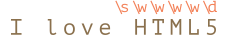

# Classes de caractères

Considérons un exemple pratique -- nous avons un numero de téléphone tel que `"+7(903)-123-45-67"`, et nous souhaitons le convertir en nombres purs : `79031234567`.

Pour ce faire, nous pouvons rechercher et supprimer tout ce qui n'est pas un nombre. Les classes de caractères peuvent nous aider.

Une *classe de caractères* est une notation spéciale qui correspond à n'importe quel symbole d'un certain ensemble.

Pour commencer, explorons la classe "digit". Elle s'écrit comme `pattern:\d` et correspond à "n'importe quel chiffre".

<<<<<<< HEAD
Par exemple, recherchons le premier chiffre du numéro de téléphone :
=======
For instance, let's find the first digit in the phone number:
>>>>>>> 23e85b3c33762347e26276ed869e491e959dd557

```js run
let str = "+7(903)-123-45-67";

let regexp = /\d/;

alert( str.match(regexp) ); // 7
```

Sans l'indicateur `pattern:g`, l'expression régulière ne recherche que la première correspondance, c'est-à-dire le premier chiffre `pattern:\d`.

Ajoutons l'indicateur `pattern:g` pour trouver tous les chiffres :

```js run
let str = "+7(903)-123-45-67";

let regexp = /\d/g;

alert( str.match(regexp) ); // liste de correspondances: 7,9,0,3,1,2,3,4,5,6,7

// Obtenons un numéro de télephone composé uniquement de ces chiffres:
alert( str.match(regexp).join('') ); // 79031234567
```

C'était une classe de caractères pour les chiffres. Il existe également d'autres classes de caractères.

Les plus utilisés sont :

`pattern:\d` ("d" vient de "digit" ("chiffre"))
: Un chiffre: un caractère de `0` à `9`.

`pattern:\s` ("s" vient de "space" ("espace"))
: Un symbole d'espace: inclut les espaces, les tabulations `\t`, les sauts de ligne `\n` et quelques autres caractères rares, tels que `\v`, `\f` et `\r`.

`pattern:\w` ("w" vient de "word" ("mot"))
: Un caractère "verbeux": soit une lettre de l'alphabet latin, soit un chiffre ou un trait de soulignement `_`. Les lettres non latines (comme le cyrillique ou l'hindi) n'appartiennent pas au `pattern:\w`.

Par exemple, `pattern:\d\s\w` signifie un "chiffre" suivi d'un "caractère espace" suivi d'un "caractère verbeux", tel que `match:1 a`.

**Une expression régulière peut contenir à la fois des symboles normaux et des classes de caractères.**

Par exemple, `pattern:CSS\d` correspond à une chaîne `match:CSS` suivi d'un chiffre :

```js run
let str = "Is there CSS4?";
let regexp = /CSS\d/

alert( str.match(regexp) ); // CSS4
```

On peut également utiliser les classes de caractères :

```js run
alert( "I love HTML5!".match(/\s\w\w\w\w\d/) ); // ' HTML5'
```

La correspondance (chaque classe de caractères d'expression régulière a le caractère de résultat correspondant) :



## Classes inverses

Pour chaque classe de caractères, il existe une "classe inverse", notée avec la même lettre, mais en majuscule.

L'"inverse" signifie qu'il correspond à tous les autres caractères, par exemple :

`pattern:\D`
: Non-chiffre: tout caractère sauf `pattern:\d`, par exemple une lettre.

`pattern:\S`
: Non-espace: tout caractère sauf `pattern:\s`, par exemple une lettre.

`pattern:\W`
: Caractère non verbal : tout sauf `pattern:\w`, par exemple une lettre non latine ou un espace.

Au début du chapitre, nous avons vu comment créer un numéro de téléphone uniquement à partir d'une chaîne telle que `subject:+7(903)-123-45-67`: trouver tous les chiffres et les concaténer.

```js run
let str = "+7(903)-123-45-67";

alert( str.match(/\d/g).join('') ); // 79031234567
```

Une autre manière, plus courte, consiste à rechercher un motif non numérique `pattern:\D` et à le supprimer de la chaîne:

```js run
let str = "+7(903)-123-45-67";

alert( str.replace(/\D/g, "") ); // 79031234567
```

## Un point est "n'importe quel caractère"

Un point `pattern:.` est une classe de caractères spéciale qui correspond à "n'importe quel caractère sauf une nouvelle ligne".

Par exemple:

```js run
alert( "Z".match(/./) ); // Z
```

Ou au milieu d'une expression régulière:

```js run
let regexp = /CS.4/;

alert( "CSS4".match(regexp) ); // CSS4
alert( "CS-4".match(regexp) ); // CS-4
alert( "CS 4".match(regexp) ); // CS 4 (l'espace est aussi un caractère)
```

Veuillez noter qu'un point signifie "n'importe quel caractère", mais pas "l'absence de caractère". Il doit y avoir un caractère avec lequel le faire correspondre :

```js run
alert( "CS4".match(/CS.4/) ); // null, pas de correspondance car il n'y a pas de caractère pour le point
```

### Point tel que n'importe quel caractère avec l'indicateur "s"

Par défaut, un point ne correspond pas au caractère de saut de ligne `\n`.

Par exemple, l'expression rationnelle `pattern:A.B` correspond à `match:A`, puis `match:B` avec n'importe quel caractère entre eux, sauf un saut de ligne `\n`:

```js run
alert( "A\nB".match(/A.B/) ); // null (pas de correspondance)
```

Il existe de nombreuses situations où nous aimerions qu'un point signifie littéralement "n'importe quel caractère", y compris le saut de ligne.

C'est ce que fait l'indicateur `pattern:s`. Si une expression rationnelle l'a, alors un point `pattern:.` correspond littéralement à n'importe quel caractère :

```js run
alert( "A\nB".match(/A.B/s) ); // A\nB (correspondance!)
```

<<<<<<< HEAD
````warn header="Non pris en charge par Firefox, IE, Edge"
Voir <https://caniuse.com/#search=dotall> pour l'état de support le plus récent. Au moment de la rédaction, il n'inclut pas Firefox, IE, Edge.

Heureusement, il existe une alternative qui fonctionne partout. Nous pouvons utiliser une expression rationnelle comme `pattern: [\s\S]` pour faire correspondre "n'importe quel caractère".
=======
````warn header="Not supported in IE"
The `pattern:s` flag is not supported in IE.

Luckily, there's an alternative, that works everywhere. We can use a regexp like `pattern:[\s\S]` to match "any character" (this pattern will be covered in the article <info:regexp-character-sets-and-ranges>).
>>>>>>> 23e85b3c33762347e26276ed869e491e959dd557

```js run
alert( "A\nB".match(/A[\s\S]B/) ); // A\nB (correspondance!)
```

Le motif `pattern:[\s\S]` dit littéralement: "un caractère espace OU pas un caractère espace". En d'autres termes, "n'importe quoi". Nous pourrions utiliser une autre paire de classes complémentaires, telles que `pattern:[\d\D]`, cela n'a pas d'importance. Ou même le `pattern:[^]` -- car cela signifie correspondre à n'importe quel caractère sauf rien.

Nous pouvons également utiliser cette astuce si nous voulons les deux types de "points" dans le même motif: le point réel `pattern:.` se comportant de manière habituelle ("ne pas inclure de saut de ligne") est également une facon de correspondre à "n'importe quel caractère" avec `pattern:[\s\S]` ou un motif semblable.
````

````warn header="Faites attention aux espaces"
Habituellement, nous prêtons peu d'attention aux espaces. Pour nous, les chaînes `subject:1-5` et `subject:1 - 5` sont presque identiques.

Mais si une expression régulière ne prend pas en compte les espaces, elle peut ne pas fonctionner.

Essayons de trouver des chiffres séparés par un tiret :

```js run
alert( "1 - 5".match(/\d-\d/) ); // null, pas de correspondance!
```

Corrigeons-le en ajoutant des espaces dans l'expression régulière `pattern:\d - \d` :

```js run
alert( "1 - 5".match(/\d - \d/) ); // 1 - 5, désormais, cela fonctionne
// ou on peut utiliser la classe \s:
alert( "1 - 5".match(/\d\s-\s\d/) ); // 1 - 5, fonctionne aussi
```

**Un espace est un caractère. Aussi important que n'importe quel autre caractère.**

<<<<<<< HEAD
Nous ne pouvons pas ajouter ou supprimer des espaces dans une expression régulière et nous attendre à ce que cela fonctionne de la même manière.
=======
We can't add or remove spaces from a regular expression and expect it to work the same.
>>>>>>> 23e85b3c33762347e26276ed869e491e959dd557

En d'autres termes, dans une expression régulière, tous les caractères comptent, les espaces aussi.
````

## Résumé

Il existe les classes de caractères suivantes :

- `pattern:\d` -- chiffres.
- `pattern:\D` -- non-chiffres.
- `pattern:\s` -- symboles d'espace, tabulations, sauts de ligne.
- `pattern:\S` -- tout sauf `pattern:\s`.
- `pattern:\w` -- Lettres latines, chiffres, soulignement `'_'`.
- `pattern:\W` -- tout sauf `pattern:\w`.
- `pattern:.` -- n'importe quel caractère avec l'indicateur d'expression régulière `'s'`, sinon tout sauf un saut de ligne `\n`.

...Mais ce n'est pas tout!

<<<<<<< HEAD
Le codage Unicode, utilisé par JavaScript pour les chaînes, fournit de nombreuses propriétés aux caractères, tels que : à quelle langue la lettre appartient (si c'est une lettre), si c'est un signe de ponctuation, etc.
=======
Unicode encoding, used by JavaScript for strings, provides many properties for characters, like: which language the letter belongs to (if it's a letter), is it a punctuation sign, etc.
>>>>>>> 23e85b3c33762347e26276ed869e491e959dd557

Nous pouvons également faire une recherche selon leurs propriétés. Cela nécessite l'indicateur `pattern:u`, couvert dans le prochain article.
