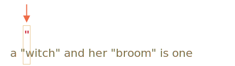
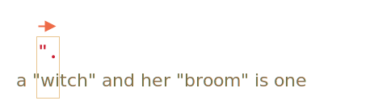
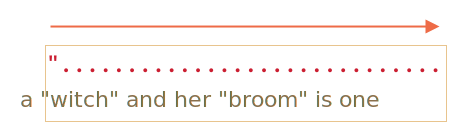
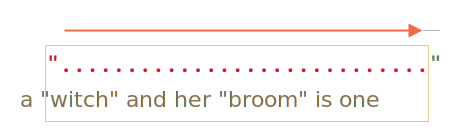
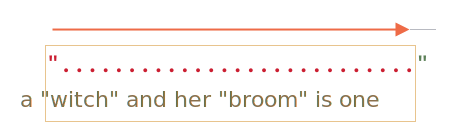
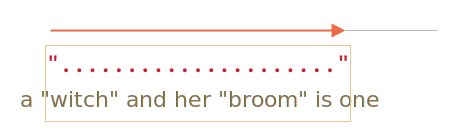
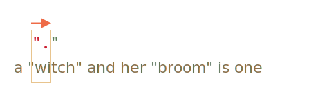
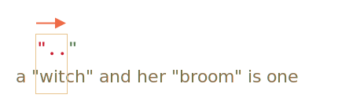
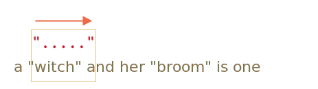
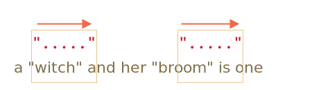

# Quantificateurs gloutons ou paresseux

Les quantificateurs, à première vue très simples, peuvent parfois être retors.

Pour réussir à trouver des motifs plus complexes que `pattern:/\d+/`, nous devons voir plus en détail comment se déroule une recherche.

Prenons comme exemple la tâche suivante.

Nous avons un texte dans lequel nous devons remplacer tous les guillemets droits (doubles) `"..."` par des guillemets français : `«...»`, souvent préférés comme typographie dans de nombreux pays.

<<<<<<< HEAD
Par exemple : `"Hello, world"` devrait se transformer en `«Hello, world»`. Il existe aussi d'autres guillemets, comme `„Witam, świat!”` (polonais) ou `「你好，世界」` (chinois), mais pour notre exemple choisissons `«...»`.
=======
For instance: `"Hello, world"` should become `«Hello, world»`. There exist other quotes, such as `„Witaj, świecie!”` (Polish) or `「你好，世界」` (Chinese), but for our task let's choose `«...»`.
>>>>>>> 733ff697c6c1101c130e2996f7eca860b2aa7ab9

La première chose à faire est de trouver ces guillemets droits, et nous pourrons ensuite les remplacer.

Une expression régulière comme `pattern:/".+"/g` (des guillemets, puis quelque chose, puis d'autres guillemets) semble être une bonne approche...

Pas exactement, voyons cela :

```js run
let regexp = /".+"/g;

let str = 'a "witch" and her "broom" is one';

alert( str.match(regexp) ); // "witch" and her "broom"
```

... Nous pouvons voir que cela ne marche pas vraiment comme prévu !

Au lieu de trouver deux correspondances `match:"witch"` et `match:"broom"`, il n'en trouve qu'une : `match:"witch" and her "broom"`.

Voyons cela comme "La gourmandise est un défaut qui cause beaucoup de torts à ceux qui s’y livrent".

## Recherche gloutonne

Pour trouver une correspondance, le moteur d'expression régulière utilise l'algorithme suivant :

- Pour chacune des positions de la chaîne de caractère
    - Essaye de trouver le motif à cette position.
    - Si aucune correspondance, va à la prochaine position.

Cette description succincte ne suffit peut-être pas à mettre en évidence l'échec précédent, alors voyons plus en détail comment se déroule la recherche du motif `pattern:".+"`.

1. Le premier caractère du motif sont des guillemets droits `pattern:"`.

    Le moteur d'expression régulière essaye de les trouver à la position zéro de la chaîne source `subject:a "witch" and her "broom" is one`, mais comme il y a un `subject:a` à cette place, il n'y a pas de correspondance possible.

    Puis il avance : va aux positions suivantes dans la chaîne source et essaye d'y trouver le premier caractère du motif, il échoue une nouvelle fois, avant de trouver les guillemets en troisième position :

    

2. Les premiers guillemets trouvés, le moteur essaye de trouver la correspondance pour la suite du motif. Il essaye de voir si le reste de la chaîne suit le motif `pattern:.+"`.

    Dans notre cas le caractère suivant dans le motif est `pattern:.` (un point). Il signifie "tout caractère, nouvelle ligne exceptée", la lettre suivante de la chaîne `match:'w'` correspond bien :

    

3. Le point est alors répété avec le quantificateur `pattern:.+`. le moteur d'expression régulière ajoute à la correspondance, les caractères les uns à la suite des autres.

    ... Jusqu'à quand ? Comme tout caractère correspond au point, il ne s'arrête qu'une fois arrivé à la fin de chaîne :

    

4. La répétition du motif `pattern:.+` maintenant finie, il essaye de trouver le caractère suivant. Ce sont des guillemets droits `pattern:"`. Mais problème : arrivé en bout de chaîne, il n'y a plus de caractère !

    Le moteur d'expression régulière comprend qu'il a pris trop de `pattern:.+` et commence à revenir sur ses pas.

    En d'autres termes, il réduit la correspondance avec le quantificateur d'un caractère :

    

    Il considère maintenant que `pattern:.+` se termine un caractère avant la fin de la chaîne et essaye de la trouver la fin du motif à partir de cette position.

    Et s'il y avait des guillemets ici, alors la recherche s'arrêterait, mais le dernier caractère est `subject:'e'`, il n'y a donc toujours pas de correspondance.

5. ... Le moteur d'expression régulière diminue encore le nombre de répétitions de `pattern:.+` d'un autre caractère :

    

    les guillemets `pattern:'"'` ne correspondent pas à `subject:'n'`.

6. Le moteur continue sa marche arrière : il réduit le nombre de répétitions de `pattern:'.'` jusqu'à trouver une correspondance pour la suite du motif (dans notre cas `pattern:'"'`) :

    

7. La correspondance au motif est complète.

8. La première correspondance est donc `match:"witch" and her "broom"`. Si l'expression régulière porte le marqueur `pattern:g`, alors la recherche continuera à partir de la fin de cette première correspondance. Comme il n'y a plus de guillemets dans la suite de la chaîne `subject:is one`, il n'y pas d'autres correspondances.

Ce n'est peut-être pas ce que nous attendions, mais c'est bien ainsi que cela fonctionne.

**En mode glouton (mode par défaut) un caractère suivi d'un quantificateur est répété autant de fois que possible.**

Le moteur d'expression régulière ajoute autant de caractères que possible pour le motif `pattern:.+`, puis réduit la correspondance caractère par caractère, si la suite du motif ne trouve pas de correspondance.

Nous avons besoin d'autre chose pour mener à bien notre tâche. Et le mode paresseux va pouvoir nous aider.

## Mode paresseux

Le mode paresseux des quantificateurs est l'opposé du mode glouton. Il signifie : "répète le motif le moins de fois possible".

Nous pouvons l'activer en ajoutant un `pattern:'?'` après le quantificateur, il devient alors  `pattern:*?` ou `pattern:+?` ou encore `pattern:??` pour le `pattern:'?'`.

Pour clarifier les choses : le point d'interrogation `pattern:?` est en général un quantificateur (zero ou un), mais si nous l'ajoutons *à la suite d'un autre quantificateur (ou bien de lui-même)* il prend une autre signification -- il change le mode de correspondance de glouton à paresseux.

La regexp `pattern:/".+?"/g` fonctionne alors comme prévu : elle trouve `match:"witch"` et `match:"broom"`:

```js run
let regexp = /".+?"/g;

let str = 'a "witch" and her "broom" is one';

alert( str.match(regexp) ); // "witch", "broom"
```

Pour bien comprendre la différence, suivons cette recherche pas à pas.

1. La première étape est la même : elle trouve le premier motif `pattern:'"'` en 3&#x1D49; position :

    

2. L'étape suivante est aussi semblable : le moteur trouve une correspondance pour le point `pattern:'.'`:

    

3. La recherche prend ensuite un chemin different. Comme nous somme en mode paresseux pour `pattern:+?`, le moteur n'essaye pas de faire correspondre à nouveau un point, mais s'arrête et essaye immédiatement de trouver une correspondance à la suite du motif `pattern:'"'` :

    

    S'il y avait des guillemets ici, alors la recherche s'arrêterait, mais il y a un `'i'`, donc pas de correspondance.
4. Le moteur d'expression régulière augmente alors le nombre de répétitions pour le point et essaye à nouveau :

    

    Nouvel échec. Le nombre de répétitions augmente alors encore et encore ...
5. ... Jusqu'à trouver une correspondance à la suite du motif :

    

6. La recherche suivante commence alors depuis la fin de la correspondance et ressort une autre résultat :

    

Dans cet exemple nous avons vu comment le mode paresseux fonctionne pour `pattern:+?`. Les quantificateurs `pattern:*?` et `pattern:??` fonctionne de la même manière -- le moteur de regexp augmente le nombre de répétitions seulement si le reste du motif ne trouve pas de correspondance à cette position.

**La paresse n'est active que pour le quantificateur suivi de `?`.**

Les autres quantificateurs restent gloutons.

Par exemple :

```js run
alert( "123 456".match(/\d+ \d+?/) ); // 123 4
```

1. Le motif `pattern:\d+` essaye de trouver autant de chiffres que possible (mode glouton), il trouve donc  `match:123` et s'arrête, car le caractère suivant est un `pattern:' '`.
2. Il y a ensuite un espace dans le motif, il y bien correspondance.
3. Enfin il y a `pattern:\d+?`. Le quantificateur est en mode paresseux, il trouve donc un chiffre `match:4` et vérifie si la suite du motif trouve une correspondance à partir d'ici.

    ... Mais il n'y a plus rien dans le motif après `pattern:\d+?`.

    Le mode paresseux ne répète rien sans en avoir besoin. Le motif est terminé, donc la recherche aussi. Nous avons une correspondance `match:123 4`.

```smart header="Optimisations"
Les moteurs d'expression régulière récents arrive à optimiser leurs algorithmes internes. Ils fonctionnent donc un peu différemment.

Mais pour comprendre comment fonctionnent les expression régulières et pour en construire, nous n'avons pas besoin d'en savoir plus. Ils sont seulement utilisés en interne pour optimiser les choses.

Comme les expressions régulières complexes sont difficiles à optimiser, la recherche peut se dérouler exactement comme nous l'avons décri.
```

## Approche alternative

Avec les expressions régulières, Il y a souvent plusieurs façons pour arriver au même résultat.

Dans notre cas, nous pouvons trouver des chaines de caractères entre guillemets sans mode paresseux en utilisant la regexp `pattern:"[^"]+"`:

```js run
let regexp = /"[^"]+"/g;

let str = 'a "witch" and her "broom" is one';

alert( str.match(regexp) ); // "witch", "broom"
```

La regexp `pattern:"[^"]+"` donne le bon résultat, parce qu'il cherche des guillemets `pattern:'"'` suivis par un ou plusieurs "non-guillemets"  `pattern:[^"]`, et ensuite les guillemets de fin.

Quand le moteur de regexp cherche le motif `pattern:[^"]+` il arrête ses répétitions en rencontrant les guillemets suivant, et renvoie la correspondance.

Mais notez que, que cette logique ne remplace pas les quantificateurs paresseux !

C'est juste différent. Suivant les cas, nous pourrons avoir besoin de l'un comme de l'autre.

**Examinons un exemple où les quantificateurs paresseux échouent mais cette variante fonctionne.**

Par exemple, nous souhaitons trouver des liens de la forme `<a href="..." class="doc">`, quel que soit le `href`.

Quelle expression régulière utiliser ?

Une première idée pourrait donner : `pattern:/<a href=".*" class="doc">/g`.

Voyons cela :
```js run
let str = '...<a href="link" class="doc">...';
let regexp = /<a href=".*" class="doc">/g;

// Ça fonctionne !
alert( str.match(regexp) ); // <a href="link" class="doc">
```

Cela a fonctionné. Mais voyons ce qu'il se passe s'il y a plusieurs liens dans le texte ?

```js run
let str = '...<a href="link1" class="doc">... <a href="link2" class="doc">...';
let regexp = /<a href=".*" class="doc">/g;

// Oups! Les deux liens dans la même correspondance!
alert( str.match(regexp) ); // <a href="link1" class="doc">... <a href="link2" class="doc">
```

Cette fois le résultat n'est pas le bon, pour la même raison que l'exemple avec "witches". Le quantificateur `pattern:.*` a pris trop de caractères.

La correspondance ressemble à cela :

```html
<a href="....................................." class="doc">
<a href="link1" class="doc">... <a href="link2" class="doc">
```

Modifions le motif en rendant le quantificateur `pattern:.*?` paresseux :

```js run
let str = '...<a href="link1" class="doc">... <a href="link2" class="doc">...';
let regexp = /<a href=".*?" class="doc">/g;

// Ça fonctionne !
alert( str.match(regexp) ); // <a href="link1" class="doc">, <a href="link2" class="doc">
```

L'expression régulière semble fonctionner à présent, il y a bien deux correspondances :

```html
<a href="....." class="doc">    <a href="....." class="doc">
<a href="link1" class="doc">... <a href="link2" class="doc">
```

... Mais testons-la sur un autre texte :

```js run
let str = '...<a href="link1" class="wrong">... <p style="" class="doc">...';
let regexp = /<a href=".*?" class="doc">/g;

// Mauvaise correspondance !
alert( str.match(regexp) ); // <a href="link1" class="wrong">... <p style="" class="doc">
```

Et maintenant ça échoue. La correspondance inclue non seulement le lien, mais aussi beaucoup du texte suivant, incluant `<p...>`.

Pourquoi ?

Voici ce qu'il se passe:

1. Pour commencer la regexp trouve un début de lien `match:<a href="`.
2. Il cherche ensuite le motif `pattern:.*?`: prend un caractère (mode paresseux !), vérifie s'il a une correspondance pour `pattern:" class="doc">` (aucune).
3. Puis prend un caractère supplémentaire dans `pattern:.*?`, et ainsi de suite... jusqu'à atteindre finalement `match:" class="doc">`.

Mais voilà le problème : c'est déjà au-delà du lien `<a...>`, dans un autre balise `<p>`. Pas vraiment ce que nous souhaitons.

Voici le schéma de la correspondance en alignant les caractères :

```html
<a href="..................................." class="doc">
<a href="link1" class="wrong">... <p style="" class="doc">
```

Nous avons donc besoin que le motif recherche `<a href="...something..." class="doc">`, mais les modes, glouton ou paresseux, rencontrent des problèmes.

Une alternative fonctionnelle peut être : `pattern:href="[^"]*"`. Cela prendra tous les caractères à l'intérieur de l'attribut `href` jusqu'aux prochains guillemets, juste ce qu'il faut.

Un exemple fonctionnel :

```js run
let str1 = '...<a href="link1" class="wrong">... <p style="" class="doc">...';
let str2 = '...<a href="link1" class="doc">... <a href="link2" class="doc">...';
let regexp = /<a href="[^"]*" class="doc">/g;

// Ça marche !
alert( str1.match(regexp) ); // null, aucune corespondance, c'est bien le résultat attendu
alert( str2.match(regexp) ); // <a href="link1" class="doc">, <a href="link2" class="doc">
```

## Résumé

Les quantificateurs ont deux modes de travail :

Glouton
: Par défaut le moteur d'expression régulière essaye de répéter le caractère quantifié autant de fois que possible. Par exemple, `pattern:\d+` consomme tous les chiffres possibles. Quand il devient impossible d'en consommer d'autre (plus aucun chiffre ou fin de chaîne), il continue alors pour trouver la fin du motif. S'il ne trouve pas de correspondance, il réduit alors le nombre de répétitions effectuées (il revient sur ses pas) et essaye à nouveau.

Paresseux
: Activé par le point d'interrogation `pattern:?` après le quantificateur. Le moteur de regexp essaye de trouver une correspondance pour le reste du motif avant chaque répétition du caractère quantifié.

Comme nous l'avons vu, Le mode paresseux n'est pas la "panacée" de la recherche gloutonne. Une alternative est une recherche gloutonne bien dosé, avec des exclusions, comme dans le motif `pattern:"[^"]+"`.
